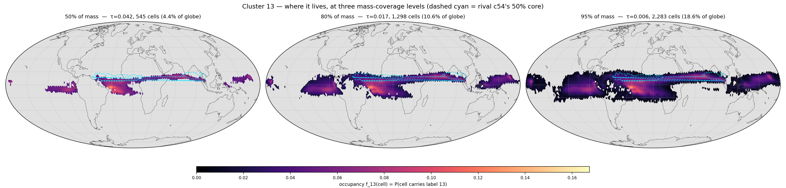
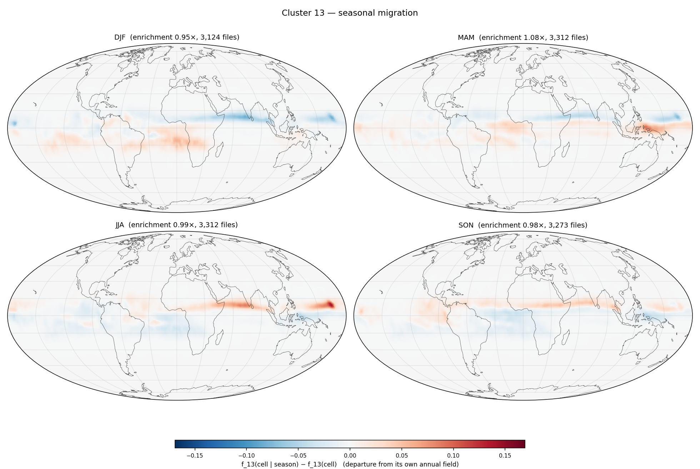

# Cluster 13 — `runs/clustering/v6_subspace_big_d64`

*Generated 2026-08-13 16:26 by `cluster_probe.py --cluster 13`. Per-cell arrays from `runs/signatures/v6_d64_margin` (13,021 files × 12,288 cells). Companion reports: `report.md` (size / EVR / affinity), `temporal_report.md` (dominant-cluster maps), `probe/shortlist.md` (all 128 clusters).*

## P0 — identity

*How to read this: one sentence generated from the numbers. Longitude is a **circular** mean and is only meaningful when the circular concentration `R_lon` is high — a zonal band and a ring around a pole both drive it to ~0, which is why it is always printed next to the latitude band.*

> **Cluster 13** holds **898,423** tokens (**0.56%** of the dataset). Half its mass sits in **545 cells** (4.4% of the globe) at occupancy **τ50 = 0.042** ⇒ it is **itinerant**. It is centred near 2.7°N with **no meaningful longitude** (R_lon = 0.44), latitude band 8.4°S…8.4°N (R_lon 0.44, R_sphere 0.44). Diagnostics: `zres` **+1.17**, `unmodelled` **0.44**, `near%` **48.1%**, **731** extreme events hosted, `seasonality` **0.062**.

Relative to the run: `zres` rank **3/128** (hardest first), `unmodelled` rank **115/128**, `events` rank **2/128**, τ50 rank **128/128** (most territorial first).

## P1 — where it lives (mass-coverage ladder)

*How to read this: the field is the cluster's **occupancy** `f_13(cell)` — the fraction of the 13,021 timesteps at which that HEALPix cell carries label 13, reduced from `label_map.npy`. Each panel keeps the smallest set of cells holding the stated fraction of the cluster's tokens (the highest-density region; `worldmap.core_region`), greying out the rest; `τ` is the occupancy at that crossing. Sliding **mass coverage** rather than a fixed occupancy threshold is what makes one map work for both kinds of cluster — τ=0.5 would show a solid blob for a territorial cluster and an empty map for an itinerant one. The three panels share one colour scale. The dashed cyan outline is the runner-up cluster's own 50% core (P4).*

| coverage | τ | cells | % of globe | % of its presence footprint |
|---|---|---|---|---|
| 50% | 0.042 | 545 | 4.4% | 12.4% |
| 80% | 0.017 | 1,298 | 10.6% | 29.5% |
| 95% | 0.006 | 2,283 | 18.6% | 51.9% |

Peak occupancy `maxf` = **0.167**; it appears at all in **4,396** cells (35.8% of the globe), which is why a presence map would be uninformative here.

## P2 — seasonal migration (departure from its own annual field)

*How to read this: each panel is `f_13(cell | season) − f_13(cell)` — the season's occupancy **minus the annual occupancy of P1**, not the raw seasonal field. The raw seasonal maps mostly restate P1; the difference isolates the *migration*. Red = the cluster is there more often in that season than on average, blue = less. Seasons follow the repo's NH convention (DJF groups December with the following Jan/Feb). The four panels share one symmetric scale.*

Seasonal enrichment (share of its tokens in that season ÷ its overall share; 1.00 = flat): **DJF 0.95×** · **MAM 1.08×** · **JJA 0.99×** · **SON 0.98×**. Annual `seasonality` (std/mean of the 12 monthly enrichments) = **0.062** (run median 0.172, max 1.122).

Per-cell seasonal amplitude for this cluster (max over seasons of |anomaly|): max **0.169**, 99th pct **0.057**.

**No diurnal counterpart.** Its token share by UTC hour is 00Z 0.252 / 06Z 0.256 / 12Z 0.239 / 18Z 0.253 — largest deviation from 0.25 is **0.011**. Measured, not assumed: the 6-hourly latents carry a seasonal cycle and essentially no diurnal one, so there is no diurnal panel.

## P3 — extreme events hosted

*How to read this: `residual_map.npy` gives a residual per cell per timestep. Raw residuals are not comparable across cells (the per-cell mean spans 15.7×), so each is scored against its own temporal norm as `z = (residual − median_cell) / (1.4826·MAD_cell)`; the top 0.1% (z ≥ 5.58) is cut and grouped into space-time connected components — adjacency is a real HEALPix NESTED neighbour at the same timestep, or the same cell at t+1. **`peak residual` is printed next to `peak z` deliberately**: a large z in a quiet cell can be a small absolute anomaly, and only the pair tells you which. An event is attributed here if its peak token carries this cluster's label. These are `(date, cell)` cases to look up, not aggregates.*

**731** events of ≥2 tokens (rank 2/128 in the run); top 10 by peak z:

| when | steps | where | cells | tokens | peak z | peak residual | glob. pct | peak cell |
|---|---|---|---|---|---|---|---|---|
| 2018-01-29T00 → 2018-02-08T12 | 43 | 20.6°S 101.3°W | 27 | 156 | 16.5 | 6,280 | 100.0% | 7303 |
| 2015-01-13T06 → 2015-01-20T12 | 30 | 35.7°S 86.0°W | 204 | 581 | 15.9 | 7,152 | 100.0% | 10748 |
| 2016-02-14T12 → 2016-02-16T12 | 9 | 19.8°S 93.3°W | 11 | 38 | 13.8 | 5,419 | 100.0% | 7319 |
| 2020-11-03T12 → 2020-11-06T00 | 11 | 14.2°N 90.0°E | 8 | 28 | 13.2 | 4,988 | 100.0% | 5942 |
| 2017-04-11T12 → 2017-04-12T06 | 4 | 8.0°S 60.5°E | 9 | 15 | 13.1 | 5,407 | 100.0% | 5678 |
| 2020-11-17T06 → 2020-11-19T06 | 9 | 13.1°N 88.9°E | 8 | 26 | 13.0 | 4,920 | 100.0% | 5942 |
| 2022-02-01T18 → 2022-02-06T12 | 20 | 20.2°S 128.2°W | 22 | 93 | 12.8 | 7,589 | 100.0% | 11107 |
| 2016-01-15T18 → 2016-01-22T12 | 28 | 19.7°S 11.7°E | 23 | 115 | 12.7 | 7,604 | 100.0% | 4187 |
| 2017-04-12T12 → 2017-04-13T18 | 6 | 4.7°S 69.3°E | 21 | 49 | 12.3 | 5,042 | 100.0% | 5687 |
| 2021-03-11T12 → 2021-03-17T00 | 23 | 20.9°S 109.4°W | 11 | 68 | 12.3 | 6,486 | 100.0% | 7337 |

Look a case up with `torch.load('latents_2/latent_{file_id}.pt')['latent'][0, {peak cell}]`; the file id is the row index of `runs/signatures/v6_d64_margin/residual_map.npy`, i.e. `datetime = 2014-01-01 00:00 UTC + file_id × 6 h`.

Whole-cluster hardness: `zres` = **+1.17** (mean robust z of *all* its tokens, run range -0.52…+1.57); mean raw residual **3,051**; `unmodelled` = residual/persistence = **0.44** (run range 0.29…1.45) — **hard mostly because it moves fast**, not because it is unmodelled.

## P4 — its rival

*How to read this: `file_signature.py` ranks every token against all K subspaces, so the runner-up is free. `near%` is the share of this cluster's own tokens whose runner-up is within 10% of the winner; `runner-up` is the single cluster that takes most of that runner-up mass. `rival_km` is the great-circle distance between the two clusters' 50%-mass core centroids — the new part, because it separates two cases the margin alone conflates.*

| | value |
|---|---|
| runner-up | **c54** |
| runner-up share of its runner-up mass | 26.1% |
| `near%` (its tokens within 10% of a rival) | 48.1% (run mean 33.0%) |
| mean margin `(R₂−R₁)/R₁` | 0.159 |
| `rival_km` (core centroid to core centroid) | **3,365 km** |
| c54's core | 198 cells at τ50 0.126, 15.5°N 13.6°E |

Verdict: **intermediate** — same hemisphere, different region. c54's 50% core is outlined in cyan on P1.

---

*Not repeated here (see `runs/clustering/v6_subspace_big_d64/report.md`): size/EVR/d80, `cells@50%`, `owned`, `files@50%`, `tCV`, `maxAff` and the affinity table. Not repeated here (see `runs/clustering/v6_subspace_big_d64/temporal_report.md`): the monthly and seasonal **dominant-cluster** maps, which show all 128 clusters at once — this report shows exactly one.*
