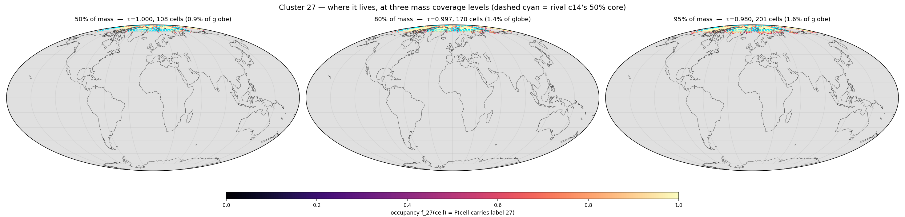
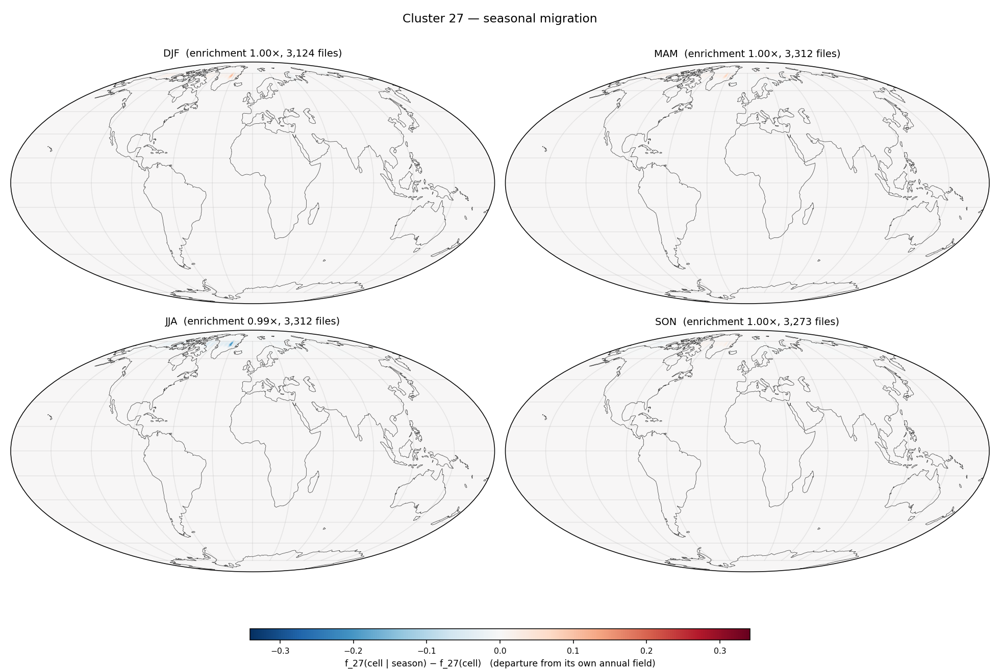

# Cluster 27 — `runs/clustering/v6_subspace_big_d64`

*Generated 2026-08-13 16:26 by `cluster_probe.py --cluster 27`. Per-cell arrays from `runs/signatures/v6_d64_margin` (13,021 files × 12,288 cells). Companion reports: `report.md` (size / EVR / affinity), `temporal_report.md` (dominant-cluster maps), `probe/shortlist.md` (all 128 clusters).*

## P0 — identity

*How to read this: one sentence generated from the numbers. Longitude is a **circular** mean and is only meaningful when the circular concentration `R_lon` is high — a zonal band and a ring around a pole both drive it to ~0, which is why it is always printed next to the latitude band.*

> **Cluster 27** holds **2,749,899** tokens (**1.72%** of the dataset). Half its mass sits in **108 cells** (0.9% of the globe) at occupancy **τ50 = 1.000** ⇒ it is **territorial**. It is centred near 88.9°N with **no meaningful longitude** (R_lon = 0.08), latitude band 75.3°N…85.6°N (R_lon 0.08, R_sphere 0.99), i.e. a **zonal band**. Diagnostics: `zres` **+0.22**, `unmodelled` **0.92**, `near%` **1.3%**, **416** extreme events hosted, `seasonality` **0.004**.

Relative to the run: `zres` rank **42/128** (hardest first), `unmodelled` rank **3/128**, `events` rank **9/128**, τ50 rank **6/128** (most territorial first).

## P1 — where it lives (mass-coverage ladder)

*How to read this: the field is the cluster's **occupancy** `f_27(cell)` — the fraction of the 13,021 timesteps at which that HEALPix cell carries label 27, reduced from `label_map.npy`. Each panel keeps the smallest set of cells holding the stated fraction of the cluster's tokens (the highest-density region; `worldmap.core_region`), greying out the rest; `τ` is the occupancy at that crossing. Sliding **mass coverage** rather than a fixed occupancy threshold is what makes one map work for both kinds of cluster — τ=0.5 would show a solid blob for a territorial cluster and an empty map for an itinerant one. The three panels share one colour scale. The dashed cyan outline is the runner-up cluster's own 50% core (P4).*

| coverage | τ | cells | % of globe | % of its presence footprint |
|---|---|---|---|---|
| 50% | 1.000 | 108 | 0.9% | 46.2% |
| 80% | 0.997 | 170 | 1.4% | 72.6% |
| 95% | 0.980 | 201 | 1.6% | 85.9% |

Peak occupancy `maxf` = **1.000**; it appears at all in **234** cells (1.9% of the globe), which is why a presence map would be uninformative here.

## P2 — seasonal migration (departure from its own annual field)

*How to read this: each panel is `f_27(cell | season) − f_27(cell)` — the season's occupancy **minus the annual occupancy of P1**, not the raw seasonal field. The raw seasonal maps mostly restate P1; the difference isolates the *migration*. Red = the cluster is there more often in that season than on average, blue = less. Seasons follow the repo's NH convention (DJF groups December with the following Jan/Feb). The four panels share one symmetric scale.*

Seasonal enrichment (share of its tokens in that season ÷ its overall share; 1.00 = flat): **DJF 1.00×** · **MAM 1.00×** · **JJA 0.99×** · **SON 1.00×**. Annual `seasonality` (std/mean of the 12 monthly enrichments) = **0.004** (run median 0.172, max 1.122).

Per-cell seasonal amplitude for this cluster (max over seasons of |anomaly|): max **0.341**, 99th pct **0.000**.

**No diurnal counterpart.** Its token share by UTC hour is 00Z 0.250 / 06Z 0.250 / 12Z 0.250 / 18Z 0.250 — largest deviation from 0.25 is **0.000**. Measured, not assumed: the 6-hourly latents carry a seasonal cycle and essentially no diurnal one, so there is no diurnal panel.

## P3 — extreme events hosted

*How to read this: `residual_map.npy` gives a residual per cell per timestep. Raw residuals are not comparable across cells (the per-cell mean spans 15.7×), so each is scored against its own temporal norm as `z = (residual − median_cell) / (1.4826·MAD_cell)`; the top 0.1% (z ≥ 5.58) is cut and grouped into space-time connected components — adjacency is a real HEALPix NESTED neighbour at the same timestep, or the same cell at t+1. **`peak residual` is printed next to `peak z` deliberately**: a large z in a quiet cell can be a small absolute anomaly, and only the pair tells you which. An event is attributed here if its peak token carries this cluster's label. These are `(date, cell)` cases to look up, not aggregates.*

**416** events of ≥2 tokens (rank 9/128 in the run); top 10 by peak z:

| when | steps | where | cells | tokens | peak z | peak residual | glob. pct | peak cell |
|---|---|---|---|---|---|---|---|---|
| 2015-12-28T12 → 2016-01-03T06 | 24 | 81.4°N 131.2°W | 214 | 936 | 19.5 | 4,007 | 99.8% | 3062 |
| 2018-02-04T12 → 2018-02-07T18 | 14 | 78.3°N 127.7°W | 87 | 305 | 14.3 | 2,134 | 62.8% | 2942 |
| 2020-07-18T18 → 2020-07-25T00 | 26 | 71.6°N 32.5°W | 101 | 557 | 12.7 | 1,986 | 55.4% | 4045 |
| 2018-06-06T18 → 2018-06-07T06 | 3 | 79.1°N 107.7°W | 20 | 25 | 12.3 | 2,799 | 89.5% | 3057 |
| 2017-02-15T18 → 2017-02-16T12 | 4 | 76.1°N 130.3°W | 7 | 13 | 11.8 | 2,109 | 61.6% | 3021 |
| 2014-02-05T12 → 2014-02-08T00 | 11 | 68.2°N 11.5°W | 81 | 198 | 11.6 | 1,730 | 42.6% | 3965 |
| 2015-12-27T18 → 2015-12-28T06 | 3 | 84.5°N 80.1°W | 12 | 15 | 11.5 | 2,681 | 86.0% | 4090 |
| 2022-06-27T18 → 2022-06-28T12 | 4 | 84.8°N 13.7°W | 15 | 24 | 11.1 | 2,455 | 77.6% | 4087 |
| 2018-10-02T18 → 2018-10-03T18 | 5 | 87.1°N 22.5°E | 1 | 5 | 10.8 | 2,668 | 85.6% | 1022 |
| 2018-07-22T12 → 2018-07-22T12 | 1 | 76.1°N 4.7°W | 2 | 2 | 10.8 | 1,655 | 39.0% | 3965 |

Look a case up with `torch.load('latents_2/latent_{file_id}.pt')['latent'][0, {peak cell}]`; the file id is the row index of `runs/signatures/v6_d64_margin/residual_map.npy`, i.e. `datetime = 2014-01-01 00:00 UTC + file_id × 6 h`.

Whole-cluster hardness: `zres` = **+0.22** (mean robust z of *all* its tokens, run range -0.52…+1.57); mean raw residual **975**; `unmodelled` = residual/persistence = **0.92** (run range 0.29…1.45) — **hard because unmodelled**, not because it moves.

## P4 — its rival

*How to read this: `file_signature.py` ranks every token against all K subspaces, so the runner-up is free. `near%` is the share of this cluster's own tokens whose runner-up is within 10% of the winner; `runner-up` is the single cluster that takes most of that runner-up mass. `rival_km` is the great-circle distance between the two clusters' 50%-mass core centroids — the new part, because it separates two cases the margin alone conflates.*

| | value |
|---|---|
| runner-up | **c14** |
| runner-up share of its runner-up mass | 42.2% |
| `near%` (its tokens within 10% of a rival) | 1.3% (run mean 33.0%) |
| mean margin `(R₂−R₁)/R₁` | 0.519 |
| `rival_km` (core centroid to core centroid) | **115 km** |
| c14's core | 30 cells at τ50 1.000, 89.9°N 48.7°W |

Verdict: **local blur** — the rival's core is next door, so the near-ties are a map gradient (one region shading into its neighbour), not a confusion of unlike states. c14's 50% core is outlined in cyan on P1.

**Mutual pair:** c14's own runner-up is c27, so these two contest each other symmetrically (1% / 3% near-ties).

---

*Not repeated here (see `runs/clustering/v6_subspace_big_d64/report.md`): size/EVR/d80, `cells@50%`, `owned`, `files@50%`, `tCV`, `maxAff` and the affinity table. Not repeated here (see `runs/clustering/v6_subspace_big_d64/temporal_report.md`): the monthly and seasonal **dominant-cluster** maps, which show all 128 clusters at once — this report shows exactly one.*
