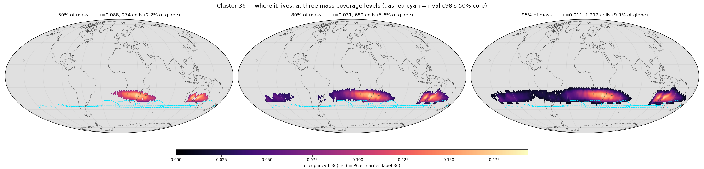
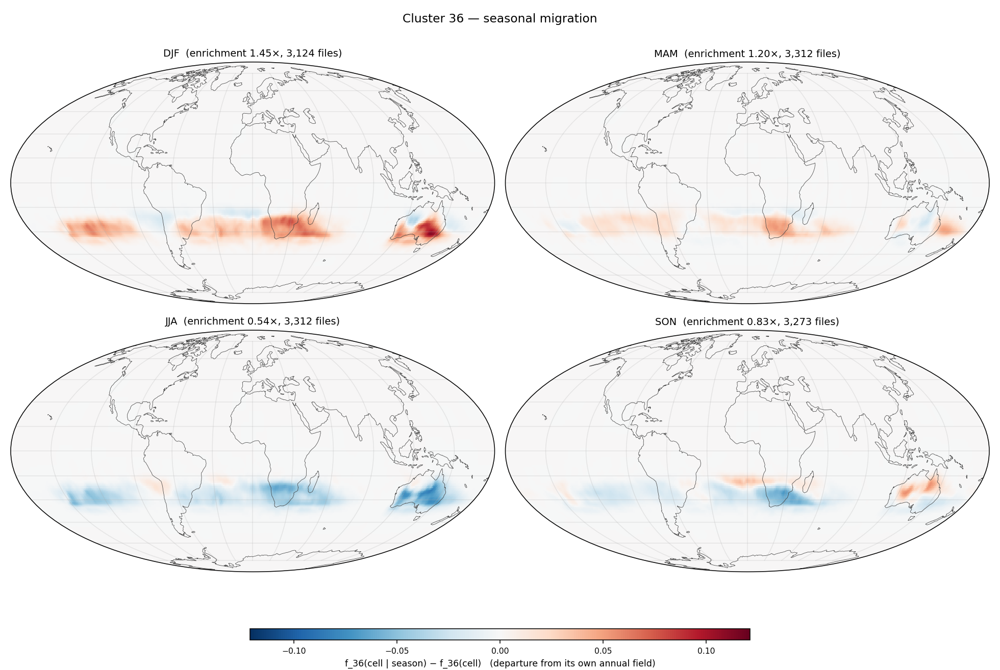

# Cluster 36 — `runs/clustering/v6_subspace_big_d64`

*Generated 2026-08-13 16:26 by `cluster_probe.py --cluster 36`. Per-cell arrays from `runs/signatures/v6_d64_margin` (13,021 files × 12,288 cells). Companion reports: `report.md` (size / EVR / affinity), `temporal_report.md` (dominant-cluster maps), `probe/shortlist.md` (all 128 clusters).*

## P0 — identity

*How to read this: one sentence generated from the numbers. Longitude is a **circular** mean and is only meaningful when the circular concentration `R_lon` is high — a zonal band and a ring around a pole both drive it to ~0, which is why it is always printed next to the latitude band.*

> **Cluster 36** holds **906,282** tokens (**0.57%** of the dataset). Half its mass sits in **274 cells** (2.2% of the globe) at occupancy **τ50 = 0.088** ⇒ it is **itinerant**. It is centred near 37.7°S 53.9°E, latitude band 31.4°S…22.0°S (R_lon 0.64, R_sphere 0.73). Diagnostics: `zres` **+1.57**, `unmodelled` **0.47**, `near%` **43.4%**, **495** extreme events hosted, `seasonality` **0.381**.

Relative to the run: `zres` rank **1/128** (hardest first), `unmodelled` rank **112/128**, `events` rank **7/128**, τ50 rank **126/128** (most territorial first).

## P1 — where it lives (mass-coverage ladder)

*How to read this: the field is the cluster's **occupancy** `f_36(cell)` — the fraction of the 13,021 timesteps at which that HEALPix cell carries label 36, reduced from `label_map.npy`. Each panel keeps the smallest set of cells holding the stated fraction of the cluster's tokens (the highest-density region; `worldmap.core_region`), greying out the rest; `τ` is the occupancy at that crossing. Sliding **mass coverage** rather than a fixed occupancy threshold is what makes one map work for both kinds of cluster — τ=0.5 would show a solid blob for a territorial cluster and an empty map for an itinerant one. The three panels share one colour scale. The dashed cyan outline is the runner-up cluster's own 50% core (P4).*

| coverage | τ | cells | % of globe | % of its presence footprint |
|---|---|---|---|---|
| 50% | 0.088 | 274 | 2.2% | 9.0% |
| 80% | 0.031 | 682 | 5.6% | 22.3% |
| 95% | 0.011 | 1,212 | 9.9% | 39.6% |

Peak occupancy `maxf` = **0.194**; it appears at all in **3,059** cells (24.9% of the globe), which is why a presence map would be uninformative here.

## P2 — seasonal migration (departure from its own annual field)

*How to read this: each panel is `f_36(cell | season) − f_36(cell)` — the season's occupancy **minus the annual occupancy of P1**, not the raw seasonal field. The raw seasonal maps mostly restate P1; the difference isolates the *migration*. Red = the cluster is there more often in that season than on average, blue = less. Seasons follow the repo's NH convention (DJF groups December with the following Jan/Feb). The four panels share one symmetric scale.*

Seasonal enrichment (share of its tokens in that season ÷ its overall share; 1.00 = flat): **DJF 1.45×** · **MAM 1.20×** · **JJA 0.54×** · **SON 0.83×**. Annual `seasonality` (std/mean of the 12 monthly enrichments) = **0.381** (run median 0.172, max 1.122).

Per-cell seasonal amplitude for this cluster (max over seasons of |anomaly|): max **0.121**, 99th pct **0.063**.

**No diurnal counterpart.** Its token share by UTC hour is 00Z 0.250 / 06Z 0.250 / 12Z 0.249 / 18Z 0.251 — largest deviation from 0.25 is **0.001**. Measured, not assumed: the 6-hourly latents carry a seasonal cycle and essentially no diurnal one, so there is no diurnal panel.

## P3 — extreme events hosted

*How to read this: `residual_map.npy` gives a residual per cell per timestep. Raw residuals are not comparable across cells (the per-cell mean spans 15.7×), so each is scored against its own temporal norm as `z = (residual − median_cell) / (1.4826·MAD_cell)`; the top 0.1% (z ≥ 5.58) is cut and grouped into space-time connected components — adjacency is a real HEALPix NESTED neighbour at the same timestep, or the same cell at t+1. **`peak residual` is printed next to `peak z` deliberately**: a large z in a quiet cell can be a small absolute anomaly, and only the pair tells you which. An event is attributed here if its peak token carries this cluster's label. These are `(date, cell)` cases to look up, not aggregates.*

**495** events of ≥2 tokens (rank 7/128 in the run); top 10 by peak z:

| when | steps | where | cells | tokens | peak z | peak residual | glob. pct | peak cell |
|---|---|---|---|---|---|---|---|---|
| 2017-03-09T18 → 2017-03-12T12 | 12 | 35.0°S 132.3°W | 54 | 133 | 20.8 | 3,977 | 99.8% | 11024 |
| 2018-01-08T00 → 2018-01-10T06 | 10 | 31.4°S 130.3°W | 23 | 42 | 17.4 | 3,445 | 98.5% | 11024 |
| 2022-02-06T18 → 2022-02-10T06 | 15 | 31.1°S 137.8°W | 25 | 70 | 17.2 | 3,405 | 98.3% | 11019 |
| 2019-01-25T00 → 2019-01-26T18 | 8 | 33.2°S 116.7°E | 16 | 42 | 15.9 | 7,691 | 100.0% | 9933 |
| 2019-02-06T18 → 2019-02-10T06 | 15 | 29.4°S 106.6°W | 53 | 114 | 14.6 | 6,609 | 100.0% | 10710 |
| 2018-03-16T00 → 2018-03-22T06 | 26 | 28.5°S 127.5°W | 36 | 103 | 14.5 | 5,500 | 100.0% | 11037 |
| 2016-11-11T06 → 2016-11-11T06 | 1 | 33.5°S 40.1°W | 2 | 2 | 14.3 | 3,386 | 98.2% | 12048 |
| 2019-01-25T06 → 2019-01-27T00 | 8 | 35.5°S 125.7°W | 17 | 30 | 13.5 | 2,836 | 90.4% | 11024 |
| 2018-02-12T06 → 2018-02-12T18 | 3 | 34.2°S 42.9°E | 2 | 4 | 13.3 | 3,355 | 98.0% | 8971 |
| 2020-04-10T00 → 2020-04-10T06 | 2 | 29.8°S 20.5°E | 6 | 7 | 12.6 | 5,425 | 100.0% | 8934 |

Look a case up with `torch.load('latents_2/latent_{file_id}.pt')['latent'][0, {peak cell}]`; the file id is the row index of `runs/signatures/v6_d64_margin/residual_map.npy`, i.e. `datetime = 2014-01-01 00:00 UTC + file_id × 6 h`.

Whole-cluster hardness: `zres` = **+1.57** (mean robust z of *all* its tokens, run range -0.52…+1.57); mean raw residual **2,691**; `unmodelled` = residual/persistence = **0.47** (run range 0.29…1.45) — **hard mostly because it moves fast**, not because it is unmodelled.

## P4 — its rival

*How to read this: `file_signature.py` ranks every token against all K subspaces, so the runner-up is free. `near%` is the share of this cluster's own tokens whose runner-up is within 10% of the winner; `runner-up` is the single cluster that takes most of that runner-up mass. `rival_km` is the great-circle distance between the two clusters' 50%-mass core centroids — the new part, because it separates two cases the margin alone conflates.*

| | value |
|---|---|
| runner-up | **c98** |
| runner-up share of its runner-up mass | 27.0% |
| `near%` (its tokens within 10% of a rival) | 43.4% (run mean 33.0%) |
| mean margin `(R₂−R₁)/R₁` | 0.158 |
| `rival_km` (core centroid to core centroid) | **3,496 km** |
| c98's core | 308 cells at τ50 0.118, 68.7°S 45.1°E |

Verdict: **intermediate** — same hemisphere, different region. c98's 50% core is outlined in cyan on P1.

**Mutual pair:** c98's own runner-up is c36, so these two contest each other symmetrically (43% / 42% near-ties).

---

*Not repeated here (see `runs/clustering/v6_subspace_big_d64/report.md`): size/EVR/d80, `cells@50%`, `owned`, `files@50%`, `tCV`, `maxAff` and the affinity table. Not repeated here (see `runs/clustering/v6_subspace_big_d64/temporal_report.md`): the monthly and seasonal **dominant-cluster** maps, which show all 128 clusters at once — this report shows exactly one.*
