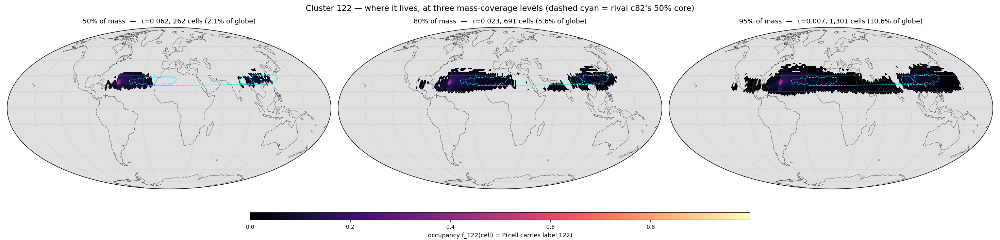
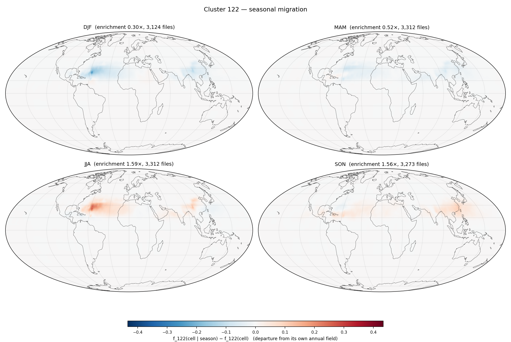

# Cluster 122 — `runs/clustering/v6_subspace_big_d64`

*Generated 2026-08-13 16:26 by `cluster_probe.py --cluster 122`. Per-cell arrays from `runs/signatures/v6_d64_margin` (13,021 files × 12,288 cells). Companion reports: `report.md` (size / EVR / affinity), `temporal_report.md` (dominant-cluster maps), `probe/shortlist.md` (all 128 clusters).*

## P0 — identity

*How to read this: one sentence generated from the numbers. Longitude is a **circular** mean and is only meaningful when the circular concentration `R_lon` is high — a zonal band and a ring around a pole both drive it to ~0, which is why it is always printed next to the latitude band.*

> **Cluster 122** holds **698,543** tokens (**0.44%** of the dataset). Half its mass sits in **262 cells** (2.1% of the globe) at occupancy **τ50 = 0.062** ⇒ it is **itinerant**. It is centred near 40.5°N with **no meaningful longitude** (R_lon = 0.54), latitude band 19.5°N…30.0°N (R_lon 0.54, R_sphere 0.65). Diagnostics: `zres` **+1.52**, `unmodelled` **0.56**, `near%` **45.7%**, **1027** extreme events hosted, `seasonality` **0.663**.

**Note the split personality:** peak occupancy is 1.00 — it owns a handful of cells outright, permanently — yet τ50 is only 0.062, so its *mass* is smeared over 262 cells. This is exactly why `maxf` is not the territoriality scalar and τ50 is.

Relative to the run: `zres` rank **2/128** (hardest first), `unmodelled` rank **93/128**, `events` rank **1/128**, τ50 rank **127/128** (most territorial first).

## P1 — where it lives (mass-coverage ladder)

*How to read this: the field is the cluster's **occupancy** `f_122(cell)` — the fraction of the 13,021 timesteps at which that HEALPix cell carries label 122, reduced from `label_map.npy`. Each panel keeps the smallest set of cells holding the stated fraction of the cluster's tokens (the highest-density region; `worldmap.core_region`), greying out the rest; `τ` is the occupancy at that crossing. Sliding **mass coverage** rather than a fixed occupancy threshold is what makes one map work for both kinds of cluster — τ=0.5 would show a solid blob for a territorial cluster and an empty map for an itinerant one. The three panels share one colour scale. The dashed cyan outline is the runner-up cluster's own 50% core (P4).*

| coverage | τ | cells | % of globe | % of its presence footprint |
|---|---|---|---|---|
| 50% | 0.062 | 262 | 2.1% | 8.7% |
| 80% | 0.023 | 691 | 5.6% | 22.9% |
| 95% | 0.007 | 1,301 | 10.6% | 43.0% |

Peak occupancy `maxf` = **0.998**; it appears at all in **3,023** cells (24.6% of the globe), which is why a presence map would be uninformative here.

## P2 — seasonal migration (departure from its own annual field)

*How to read this: each panel is `f_122(cell | season) − f_122(cell)` — the season's occupancy **minus the annual occupancy of P1**, not the raw seasonal field. The raw seasonal maps mostly restate P1; the difference isolates the *migration*. Red = the cluster is there more often in that season than on average, blue = less. Seasons follow the repo's NH convention (DJF groups December with the following Jan/Feb). The four panels share one symmetric scale.*

Seasonal enrichment (share of its tokens in that season ÷ its overall share; 1.00 = flat): **DJF 0.30×** · **MAM 0.52×** · **JJA 1.59×** · **SON 1.56×**. Annual `seasonality` (std/mean of the 12 monthly enrichments) = **0.663** (run median 0.172, max 1.122).

Per-cell seasonal amplitude for this cluster (max over seasons of |anomaly|): max **0.434**, 99th pct **0.093**.

**No diurnal counterpart.** Its token share by UTC hour is 00Z 0.246 / 06Z 0.252 / 12Z 0.242 / 18Z 0.259 — largest deviation from 0.25 is **0.009**. Measured, not assumed: the 6-hourly latents carry a seasonal cycle and essentially no diurnal one, so there is no diurnal panel.

## P3 — extreme events hosted

*How to read this: `residual_map.npy` gives a residual per cell per timestep. Raw residuals are not comparable across cells (the per-cell mean spans 15.7×), so each is scored against its own temporal norm as `z = (residual − median_cell) / (1.4826·MAD_cell)`; the top 0.1% (z ≥ 5.58) is cut and grouped into space-time connected components — adjacency is a real HEALPix NESTED neighbour at the same timestep, or the same cell at t+1. **`peak residual` is printed next to `peak z` deliberately**: a large z in a quiet cell can be a small absolute anomaly, and only the pair tells you which. An event is attributed here if its peak token carries this cluster's label. These are `(date, cell)` cases to look up, not aggregates.*

**1027** events of ≥2 tokens (rank 1/128 in the run); top 10 by peak z:

| when | steps | where | cells | tokens | peak z | peak residual | glob. pct | peak cell |
|---|---|---|---|---|---|---|---|---|
| 2022-06-30T18 → 2022-07-02T12 | 8 | 52.2°N 159.7°W | 22 | 58 | 27.8 | 4,228 | 99.9% | 2767 |
| 2019-09-30T00 → 2019-10-03T00 | 13 | 37.9°N 144.3°E | 57 | 103 | 26.6 | 5,299 | 100.0% | 1247 |
| 2014-02-19T00 → 2014-02-24T00 | 21 | 31.1°S 138.8°W | 38 | 94 | 20.5 | 3,923 | 99.7% | 11019 |
| 2016-08-31T00 → 2016-09-03T06 | 14 | 37.5°N 139.8°E | 30 | 55 | 19.3 | 4,280 | 99.9% | 1272 |
| 2014-10-17T06 → 2014-10-18T18 | 7 | 32.7°N 114.5°E | 14 | 22 | 17.3 | 5,845 | 100.0% | 1562 |
| 2021-10-03T12 → 2021-10-04T18 | 6 | 40.4°N 129.9°E | 18 | 24 | 16.0 | 3,829 | 99.6% | 1792 |
| 2018-03-19T12 → 2018-03-25T06 | 24 | 20.8°S 70.7°W | 59 | 178 | 16.0 | 7,985 | 100.0% | 7432 |
| 2022-09-10T06 → 2022-09-12T00 | 8 | 43.7°N 126.3°E | 20 | 65 | 15.8 | 4,136 | 99.9% | 1613 |
| 2017-09-07T00 → 2017-09-08T00 | 5 | 19.8°N 109.2°E | 4 | 9 | 15.8 | 5,764 | 100.0% | 5975 |
| 2022-06-21T12 → 2022-06-22T18 | 6 | 42.1°N 175.7°W | 55 | 108 | 15.5 | 5,948 | 100.0% | 7162 |

Look a case up with `torch.load('latents_2/latent_{file_id}.pt')['latent'][0, {peak cell}]`; the file id is the row index of `runs/signatures/v6_d64_margin/residual_map.npy`, i.e. `datetime = 2014-01-01 00:00 UTC + file_id × 6 h`.

Whole-cluster hardness: `zres` = **+1.52** (mean robust z of *all* its tokens, run range -0.52…+1.57); mean raw residual **2,863**; `unmodelled` = residual/persistence = **0.56** (run range 0.29…1.45) — **hard mostly because it moves fast**, not because it is unmodelled.

## P4 — its rival

*How to read this: `file_signature.py` ranks every token against all K subspaces, so the runner-up is free. `near%` is the share of this cluster's own tokens whose runner-up is within 10% of the winner; `runner-up` is the single cluster that takes most of that runner-up mass. `rival_km` is the great-circle distance between the two clusters' 50%-mass core centroids — the new part, because it separates two cases the margin alone conflates.*

| | value |
|---|---|
| runner-up | **c82** |
| runner-up share of its runner-up mass | 16.6% |
| `near%` (its tokens within 10% of a rival) | 45.7% (run mean 33.0%) |
| mean margin `(R₂−R₁)/R₁` | 0.175 |
| `rival_km` (core centroid to core centroid) | **5,849 km** |
| c82's core | 176 cells at τ50 0.290, 46.5°N 40.0°E |

Verdict: **remote confusion** — the rival's core is on the other side of the world, so these near-ties are a genuine embedding-space ambiguity between geographically unrelated states (look for a cross-hemisphere seasonal mirror: compare the two clusters' P2 panels). c82's 50% core is outlined in cyan on P1.

---

*Not repeated here (see `runs/clustering/v6_subspace_big_d64/report.md`): size/EVR/d80, `cells@50%`, `owned`, `files@50%`, `tCV`, `maxAff` and the affinity table. Not repeated here (see `runs/clustering/v6_subspace_big_d64/temporal_report.md`): the monthly and seasonal **dominant-cluster** maps, which show all 128 clusters at once — this report shows exactly one.*
