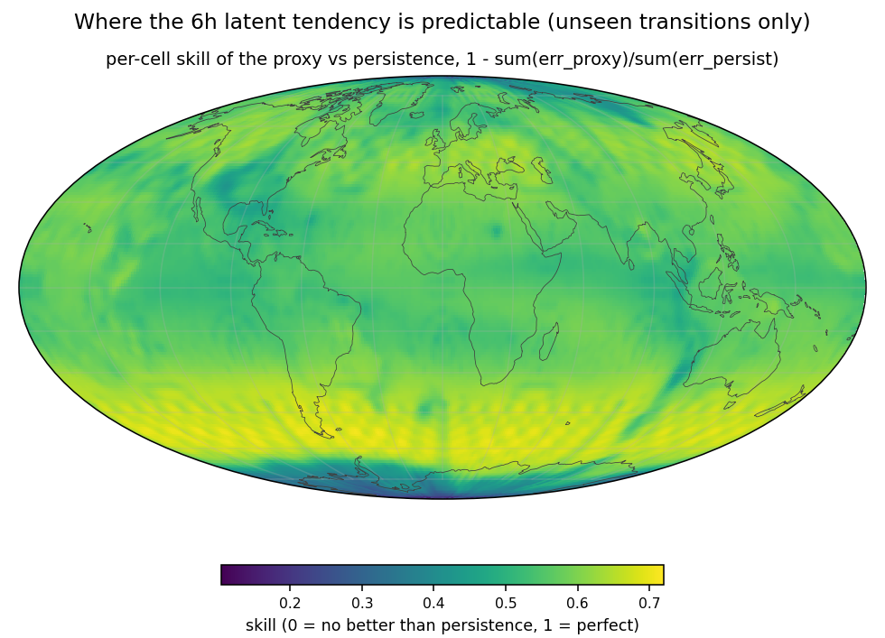

# Proxy forecaster — `runs/proxy/v1`

*Generated by `proxy_forecast.py`. 42.1 min on one A40 including full-dataset inference. Config: dim 512, 6 blocks, 20,000 steps, batch 8,192 cells, 20×150 = 3,000 files loaded.*

## What this is

A small latent→latent forecaster trained on `latents_2` to predict the 6 h tendency `Δ = x_{t+1} − x_t`. It exists to supply a **model error** for timestamp selection without the WeatherGenerator checkpoint — see `docs/ideas/latent_selection.md` Tier 2b. The output head is zero-initialised, so training starts at exactly persistence and skill against `err_persist.npy` is the native metric (ratio of sums).

## Skill vs persistence

| set | n transitions | skill |
|---|---|---|
| all | 13,020 | **+0.5822** |
| inside training chunks | 2,980 | +0.5844 |
| **fully unseen (76.8%)** | 10,001 | **+0.5815** |

A 0.003 gap between seen and unseen: the field is trustworthy over the whole record.

Per-cell skill is positive in **all 12,288 cells** — min +0.104, median +0.574, max +0.720. By zone: mid-latitudes +0.618 > tropics +0.559 > polar +0.506.

## Neighbour ablation

| context | held-out skill |
|---|---|
| own token + 8 HEALPix neighbours | **+0.5860** |
| own token only (`--no-neighbours`) | +0.4907 |

Spatial context is worth ~9.5 points. But a **cell-only** model still reaches +0.49, so the 2048-d token at one cell already encodes most of what predicts its own 6 h evolution — these latents carry local dynamical state, not just an instantaneous snapshot. That is a finding about the embedding, independent of the selection goal.

## Convergence

| step | train | val | persistence | skill |
|---|---|---|---|---|
| 500 | 2361.3 | 2243.5 | 3034.8 | +0.2607 |
| 2,500 | 1542.9 | 1552.4 | 3061.9 | +0.4930 |
| 4,500 | 1398.8 | 1424.3 | 3099.2 | +0.5404 |
| 6,500 | 1510.5 | 1425.6 | 3127.8 | +0.5442 |
| 8,500 | 1412.6 | 1377.8 | 3092.3 | +0.5544 |
| 10,500 | 1464.9 | 1341.2 | 3089.5 | +0.5659 |
| 12,500 | 1350.8 | 1359.0 | 3107.2 | +0.5626 |
| 14,500 | 1420.3 | 1380.0 | 3184.4 | +0.5666 |
| 16,500 | 1309.6 | 1308.7 | 3103.1 | +0.5783 |
| 18,500 | 1422.9 | 1353.0 | 3119.1 | +0.5662 |
| 20,000 | 1408.0 | 1273.3 | 3075.2 | +0.5860 |

## Output contract

`err_proxy.npy [13020, 12288] float32` — `err[t,cell] = ‖pred_Δ − true_Δ‖²`, NESTED HEALPix, row *t* = transition *t*→*t+1*. **Identical shape/contract/ordering to `err_persist.npy` and the planned `err_forecast.npy`**, so it gathers directly onto `assignments.pt` and `analyze_forecast_error.py` reads it unchanged.

## Caveats

- ~11 M parameters against the WeatherGenerator's ~0.8 B, and it predicts a latent tendency rather than the physical fields the real loss scores. Selection via Proxy warns that proxy-based selection is high-variance when extrapolating from few models.
- Measured in the raw encoder space. Legitimate here (trained *and* evaluated in that one space, so `docs/wgen_architecture.md` §5b's mismatch cannot arise), but it means `err_proxy` and a future `err_forecast` are not on a common scale.

