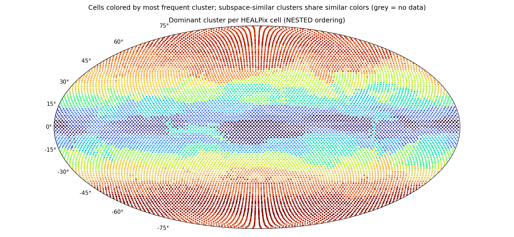

# Subspace clustering report — `subspace_big`

*Generated 2026-06-12 12:18 by `analyze_subspaces.py`. K=128 affine subspaces of dim 32 in 2048-dim token space, 86,016,000 tokens.*

## Configuration

| parameter | value |
|---|---|
| src | latents_2 |
| num_files | 7000 |
| tokens_per_file | 12288 |
| clusters | 128 |
| dim | 32 |
| iters | 40 |
| tol | 0.001 |
| linear | False |
| seed | 0 |
| chunk_size | 262144 |
| gpus | 2 |
| tokens analyzed | 86,016,000 |

## Token sample

- **Sample fingerprint:** `82ca602ed7e7` — runs sharing this fingerprint were clustered on the identical token set and are directly comparable.
- **Files:** 7000 latent files, 12288 tokens each, seed 0.
- **Reproduce this exact sample** for a new run (e.g. to vary K or d):

  ```bash
  python3 subspace_kmeans.py --files-from subspace_big/sample.json --seed 0 --tokens-per-file 12288 \
      --clusters <K> --dim <d> --out <new_dir>
  ```
- File ids (first 20 of 7000, full list in `subspace_big/sample.json`): 0, 1, 6, 8, 9, 10, 11, 12, 13, 14, 16, 18, 19, 21, 22, 24, 25, 26, 27, 28 …

## Convergence

| iter | objective/token | labels changed | min size | max size |
|---|---|---|---|---|
| 1 | 7659.20 | 100.00% | 127 | 23,702,502 |
| 2 | 3092.84 | 74.64% | 2,108 | 5,171,010 |
| 3 | 2834.43 | 40.86% | 31,953 | 2,312,301 |
| 4 | 2765.63 | 22.33% | 125,563 | 1,977,172 |
| 5 | 2737.22 | 14.81% | 156,615 | 1,676,012 |
| 6 | 2722.19 | 10.95% | 171,476 | 1,581,330 |
| 7 | 2712.85 | 8.58% | 182,258 | 1,531,793 |
| 8 | 2706.53 | 6.97% | 188,586 | 1,491,608 |
| 9 | 2701.97 | 5.87% | 193,709 | 1,457,367 |
| 10 | 2698.40 | 5.10% | 198,848 | 1,444,461 |
| 11 | 2695.57 | 4.51% | 205,626 | 1,421,788 |
| 12 | 2693.21 | 4.09% | 210,482 | 1,395,454 |
| 13 | 2691.12 | 3.74% | 214,633 | 1,380,268 |
| 14 | 2689.34 | 3.40% | 219,147 | 1,375,497 |
| 15 | 2687.80 | 3.11% | 220,110 | 1,376,128 |
| 16 | 2686.40 | 2.87% | 219,939 | 1,378,148 |
| 17 | 2685.20 | 2.65% | 219,637 | 1,379,993 |
| 18 | 2684.18 | 2.46% | 219,318 | 1,381,436 |
| 19 | 2683.30 | 2.29% | 219,277 | 1,382,534 |
| 20 | 2682.55 | 2.13% | 219,580 | 1,383,572 |
| 21 | 2681.86 | 2.01% | 220,328 | 1,384,443 |
| 22 | 2681.22 | 1.89% | 221,170 | 1,385,269 |
| 23 | 2680.70 | 1.78% | 221,624 | 1,385,951 |
| 24 | 2680.22 | 1.67% | 221,293 | 1,386,489 |
| 25 | 2679.79 | 1.58% | 221,704 | 1,386,832 |
| 26 | 2679.41 | 1.49% | 222,946 | 1,387,125 |
| 27 | 2679.08 | 1.40% | 223,158 | 1,387,333 |
| 28 | 2678.79 | 1.34% | 223,219 | 1,387,562 |
| 29 | 2678.52 | 1.29% | 223,006 | 1,387,824 |
| 30 | 2678.27 | 1.24% | 222,595 | 1,388,035 |
| 31 | 2678.04 | 1.20% | 222,159 | 1,388,176 |
| 32 | 2677.80 | 1.16% | 221,891 | 1,388,363 |
| 33 | 2677.58 | 1.13% | 221,652 | 1,388,315 |
| 34 | 2677.37 | 1.08% | 221,451 | 1,388,330 |
| 35 | 2677.18 | 1.03% | 220,864 | 1,388,221 |
| 36 | 2677.02 | 1.00% | 220,097 | 1,388,220 |
| 37 | 2676.87 | 0.97% | 219,465 | 1,388,135 |
| 38 | 2676.71 | 0.95% | 218,948 | 1,388,079 |
| 39 | 2676.55 | 0.94% | 218,530 | 1,388,031 |
| 40 | 2676.39 | 0.92% | 218,161 | 1,388,056 |

## Global variance decomposition

Total token variance E‖x−μ_global‖² = **5998**, split into:

- **10.2%** between clusters (the means alone — how much cluster identity explains)
- **45.2%** within clusters, captured by the top-32 subspace directions
- **44.6%** residual (unexplained by the model)

Count-weighted within-cluster EVR(top-32): **0.512**. Dimensions needed for 80% of captured variance: min 16 / median 20 / max 23 (close to 32 ⇒ flat spectrum, consider larger --dim).

## Clusters (sorted by size)

Spatial columns are over the 12288 HEALPix cells with data; `cells@50%` = number of cells holding half the cluster's tokens (low = localized); `owned` = cells where this cluster is the most common label; `files` = share of the 7000 sampled time steps where the cluster appears; `tCV` = coefficient of variation of its share across time deciles (0 = constant in time).

| cluster | tokens | share | EVR(top-32) | d80 | cells@50% | owned | files | tCV |
|---|---|---|---|---|---|---|---|---|
| 27 | 1,388,056 | 1.6% | 0.577 | 19 | 100 | 203 | 100% | 0.00 |
| 66 | 1,299,328 | 1.5% | 0.605 | 18 | 93 | 187 | 100% | 0.00 |
| 14 | 1,111,688 | 1.3% | 0.509 | 19 | 285 | 153 | 100% | 0.05 |
| 80 | 1,110,127 | 1.3% | 0.553 | 19 | 128 | 254 | 100% | 0.09 |
| 78 | 1,102,026 | 1.3% | 0.606 | 18 | 249 | 264 | 100% | 0.02 |
| 17 | 1,090,818 | 1.3% | 0.595 | 18 | 125 | 180 | 100% | 0.07 |
| 83 | 1,083,990 | 1.3% | 0.575 | 18 | 309 | 187 | 100% | 0.03 |
| 4 | 1,043,294 | 1.2% | 0.504 | 21 | 287 | 204 | 100% | 0.06 |
| 39 | 1,041,814 | 1.2% | 0.527 | 20 | 309 | 280 | 100% | 0.02 |
| 121 | 1,032,347 | 1.2% | 0.574 | 17 | 255 | 263 | 100% | 0.09 |
| 90 | 1,026,440 | 1.2% | 0.526 | 19 | 154 | 230 | 98% | 0.07 |
| 68 | 991,418 | 1.2% | 0.531 | 19 | 355 | 146 | 100% | 0.06 |
| 34 | 981,566 | 1.1% | 0.485 | 20 | 219 | 50 | 100% | 0.16 |
| 42 | 971,006 | 1.1% | 0.501 | 21 | 190 | 231 | 100% | 0.06 |
| 107 | 962,677 | 1.1% | 0.532 | 19 | 391 | 65 | 100% | 0.04 |
| 59 | 944,731 | 1.1% | 0.507 | 20 | 331 | 188 | 100% | 0.03 |
| 50 | 944,035 | 1.1% | 0.617 | 18 | 153 | 144 | 100% | 0.06 |
| 117 | 928,686 | 1.1% | 0.489 | 22 | 244 | 164 | 100% | 0.04 |
| 127 | 907,309 | 1.1% | 0.583 | 17 | 346 | 101 | 100% | 0.05 |
| 21 | 902,062 | 1.0% | 0.606 | 18 | 65 | 132 | 100% | 0.00 |
| 99 | 887,807 | 1.0% | 0.485 | 22 | 252 | 173 | 100% | 0.07 |
| 10 | 879,599 | 1.0% | 0.562 | 18 | 484 | 53 | 100% | 0.06 |
| 110 | 873,753 | 1.0% | 0.484 | 21 | 234 | 118 | 99% | 0.11 |
| 18 | 872,137 | 1.0% | 0.515 | 19 | 359 | 60 | 100% | 0.03 |
| 35 | 868,176 | 1.0% | 0.554 | 20 | 63 | 133 | 100% | 0.03 |
| 114 | 860,049 | 1.0% | 0.477 | 22 | 135 | 158 | 100% | 0.07 |
| 56 | 847,441 | 1.0% | 0.586 | 19 | 64 | 134 | 100% | 0.02 |
| 93 | 841,489 | 1.0% | 0.600 | 18 | 195 | 109 | 100% | 0.06 |
| 74 | 839,895 | 1.0% | 0.573 | 19 | 73 | 163 | 100% | 0.05 |
| 37 | 833,525 | 1.0% | 0.478 | 22 | 201 | 190 | 97% | 0.16 |
| 76 | 829,716 | 1.0% | 0.528 | 19 | 424 | 60 | 100% | 0.05 |
| 16 | 806,579 | 0.9% | 0.502 | 20 | 60 | 123 | 100% | 0.02 |
| 88 | 805,607 | 0.9% | 0.494 | 20 | 195 | 97 | 100% | 0.07 |
| 70 | 804,297 | 0.9% | 0.537 | 20 | 203 | 205 | 100% | 0.03 |
| 6 | 796,528 | 0.9% | 0.502 | 20 | 299 | 107 | 100% | 0.09 |
| 85 | 789,649 | 0.9% | 0.474 | 23 | 120 | 130 | 100% | 0.16 |
| 11 | 785,668 | 0.9% | 0.500 | 20 | 240 | 80 | 100% | 0.05 |
| 41 | 782,884 | 0.9% | 0.530 | 19 | 446 | 27 | 100% | 0.03 |
| 48 | 760,793 | 0.9% | 0.444 | 22 | 259 | 103 | 100% | 0.16 |
| 12 | 760,574 | 0.9% | 0.482 | 22 | 120 | 97 | 100% | 0.09 |
| 46 | 757,325 | 0.9% | 0.481 | 21 | 169 | 170 | 100% | 0.10 |
| 81 | 756,962 | 0.9% | 0.496 | 20 | 72 | 140 | 100% | 0.07 |
| 82 | 755,012 | 0.9% | 0.490 | 21 | 251 | 167 | 83% | 0.15 |
| 69 | 730,429 | 0.8% | 0.508 | 20 | 242 | 80 | 100% | 0.09 |
| 125 | 728,129 | 0.8% | 0.554 | 17 | 183 | 77 | 100% | 0.07 |
| 86 | 719,441 | 0.8% | 0.488 | 21 | 289 | 53 | 91% | 0.16 |
| 43 | 717,022 | 0.8% | 0.544 | 18 | 234 | 128 | 95% | 0.14 |
| 120 | 716,067 | 0.8% | 0.486 | 22 | 104 | 156 | 95% | 0.16 |
| 58 | 715,501 | 0.8% | 0.476 | 21 | 206 | 49 | 100% | 0.12 |
| 73 | 711,071 | 0.8% | 0.445 | 22 | 232 | 117 | 100% | 0.12 |
| 111 | 696,795 | 0.8% | 0.576 | 17 | 332 | 40 | 100% | 0.03 |
| 1 | 692,418 | 0.8% | 0.461 | 22 | 208 | 90 | 100% | 0.07 |
| 84 | 690,311 | 0.8% | 0.462 | 22 | 177 | 115 | 100% | 0.06 |
| 115 | 688,308 | 0.8% | 0.492 | 20 | 76 | 142 | 100% | 0.08 |
| 5 | 680,966 | 0.8% | 0.485 | 21 | 327 | 67 | 100% | 0.07 |
| 100 | 679,971 | 0.8% | 0.472 | 22 | 215 | 27 | 94% | 0.16 |
| 67 | 679,272 | 0.8% | 0.470 | 22 | 207 | 111 | 95% | 0.25 |
| 61 | 678,747 | 0.8% | 0.476 | 21 | 90 | 132 | 83% | 0.12 |
| 33 | 678,347 | 0.8% | 0.504 | 21 | 360 | 92 | 100% | 0.06 |
| 52 | 677,785 | 0.8% | 0.493 | 20 | 306 | 31 | 96% | 0.12 |
| 3 | 673,187 | 0.8% | 0.489 | 22 | 66 | 115 | 100% | 0.06 |
| 113 | 666,035 | 0.8% | 0.539 | 18 | 441 | 5 | 100% | 0.05 |
| 20 | 659,897 | 0.8% | 0.524 | 19 | 483 | 0 | 100% | 0.10 |
| 126 | 659,523 | 0.8% | 0.466 | 23 | 106 | 138 | 100% | 0.30 |
| 95 | 652,752 | 0.8% | 0.509 | 20 | 287 | 111 | 91% | 0.13 |
| 105 | 651,981 | 0.8% | 0.440 | 22 | 92 | 108 | 100% | 0.06 |
| 71 | 647,629 | 0.8% | 0.468 | 22 | 123 | 170 | 100% | 0.14 |
| 87 | 642,742 | 0.7% | 0.501 | 20 | 51 | 106 | 100% | 0.04 |
| 60 | 638,824 | 0.7% | 0.475 | 21 | 211 | 49 | 98% | 0.12 |
| 19 | 635,930 | 0.7% | 0.501 | 20 | 84 | 122 | 100% | 0.11 |
| 57 | 633,520 | 0.7% | 0.487 | 21 | 131 | 115 | 87% | 0.08 |
| 22 | 632,132 | 0.7% | 0.449 | 21 | 364 | 8 | 100% | 0.08 |
| 45 | 624,665 | 0.7% | 0.474 | 22 | 170 | 149 | 100% | 0.08 |
| 64 | 619,786 | 0.7% | 0.439 | 21 | 99 | 69 | 93% | 0.15 |
| 15 | 615,113 | 0.7% | 0.442 | 22 | 53 | 110 | 100% | 0.03 |
| 77 | 615,039 | 0.7% | 0.601 | 19 | 44 | 87 | 100% | 0.00 |
| 7 | 614,320 | 0.7% | 0.462 | 21 | 204 | 56 | 100% | 0.10 |
| 94 | 613,652 | 0.7% | 0.570 | 17 | 567 | 0 | 100% | 0.06 |
| 65 | 610,688 | 0.7% | 0.464 | 21 | 186 | 72 | 92% | 0.14 |
| 119 | 608,410 | 0.7% | 0.523 | 19 | 449 | 0 | 100% | 0.03 |
| 106 | 604,076 | 0.7% | 0.460 | 21 | 333 | 30 | 100% | 0.05 |
| 75 | 603,557 | 0.7% | 0.464 | 22 | 115 | 131 | 97% | 0.17 |
| 47 | 600,052 | 0.7% | 0.488 | 20 | 95 | 48 | 82% | 0.15 |
| 54 | 597,859 | 0.7% | 0.451 | 22 | 273 | 44 | 100% | 0.06 |
| 118 | 589,973 | 0.7% | 0.449 | 21 | 106 | 78 | 100% | 0.12 |
| 124 | 583,618 | 0.7% | 0.513 | 20 | 57 | 119 | 100% | 0.03 |
| 98 | 564,943 | 0.7% | 0.584 | 16 | 437 | 15 | 100% | 0.06 |
| 63 | 564,614 | 0.7% | 0.514 | 19 | 394 | 0 | 100% | 0.06 |
| 29 | 562,722 | 0.7% | 0.486 | 20 | 119 | 114 | 71% | 0.13 |
| 123 | 559,051 | 0.6% | 0.621 | 18 | 40 | 75 | 100% | 0.02 |
| 26 | 558,361 | 0.6% | 0.453 | 23 | 142 | 50 | 98% | 0.18 |
| 30 | 551,291 | 0.6% | 0.488 | 22 | 134 | 41 | 92% | 0.16 |
| 0 | 532,678 | 0.6% | 0.601 | 20 | 39 | 77 | 100% | 0.00 |
| 44 | 528,271 | 0.6% | 0.485 | 22 | 130 | 74 | 98% | 0.14 |
| 104 | 526,236 | 0.6% | 0.462 | 21 | 117 | 81 | 98% | 0.14 |
| 36 | 515,845 | 0.6% | 0.467 | 21 | 277 | 9 | 99% | 0.11 |
| 25 | 506,927 | 0.6% | 0.569 | 19 | 37 | 81 | 100% | 0.02 |
| 24 | 497,248 | 0.6% | 0.468 | 20 | 101 | 134 | 69% | 0.15 |
| 97 | 494,692 | 0.6% | 0.473 | 21 | 57 | 104 | 100% | 0.06 |
| 101 | 489,699 | 0.6% | 0.476 | 22 | 176 | 47 | 90% | 0.14 |
| 8 | 484,942 | 0.6% | 0.466 | 22 | 46 | 97 | 100% | 0.04 |
| 40 | 481,720 | 0.6% | 0.451 | 22 | 187 | 54 | 100% | 0.09 |
| 112 | 480,860 | 0.6% | 0.454 | 22 | 60 | 54 | 100% | 0.09 |
| 102 | 478,682 | 0.6% | 0.484 | 20 | 85 | 79 | 99% | 0.09 |
| 108 | 478,610 | 0.6% | 0.488 | 21 | 87 | 81 | 100% | 0.04 |
| 51 | 461,566 | 0.5% | 0.494 | 20 | 43 | 83 | 100% | 0.03 |
| 91 | 443,879 | 0.5% | 0.486 | 20 | 62 | 43 | 99% | 0.12 |
| 96 | 440,324 | 0.5% | 0.496 | 21 | 37 | 74 | 100% | 0.06 |
| 9 | 437,074 | 0.5% | 0.463 | 22 | 100 | 64 | 91% | 0.18 |
| 89 | 429,828 | 0.5% | 0.530 | 20 | 32 | 64 | 100% | 0.01 |
| 53 | 420,555 | 0.5% | 0.472 | 21 | 65 | 51 | 86% | 0.09 |
| 103 | 418,911 | 0.5% | 0.448 | 22 | 72 | 42 | 75% | 0.13 |
| 13 | 412,667 | 0.5% | 0.482 | 20 | 433 | 0 | 100% | 0.05 |
| 122 | 401,318 | 0.5% | 0.522 | 18 | 245 | 5 | 82% | 0.11 |
| 32 | 401,150 | 0.5% | 0.518 | 20 | 30 | 61 | 100% | 0.02 |
| 31 | 398,437 | 0.5% | 0.490 | 20 | 212 | 11 | 100% | 0.10 |
| 72 | 355,191 | 0.4% | 0.470 | 21 | 43 | 66 | 95% | 0.11 |
| 79 | 347,077 | 0.4% | 0.476 | 21 | 26 | 47 | 100% | 0.04 |
| 49 | 334,611 | 0.4% | 0.559 | 19 | 28 | 62 | 100% | 0.05 |
| 38 | 327,292 | 0.4% | 0.464 | 22 | 39 | 46 | 100% | 0.04 |
| 116 | 319,645 | 0.4% | 0.488 | 21 | 57 | 19 | 99% | 0.10 |
| 109 | 309,352 | 0.4% | 0.503 | 21 | 58 | 73 | 61% | 0.14 |
| 23 | 308,268 | 0.4% | 0.464 | 22 | 23 | 47 | 100% | 0.03 |
| 55 | 302,636 | 0.4% | 0.544 | 19 | 23 | 48 | 100% | 0.01 |
| 2 | 285,162 | 0.3% | 0.505 | 21 | 21 | 40 | 100% | 0.01 |
| 62 | 277,286 | 0.3% | 0.531 | 20 | 21 | 45 | 100% | 0.01 |
| 92 | 273,795 | 0.3% | 0.474 | 22 | 21 | 44 | 100% | 0.04 |
| 28 | 218,161 | 0.3% | 0.572 | 19 | 21 | 16 | 100% | 0.10 |

## Subspace affinity between clusters

Affinity(i,j) = ‖Uᵢᵀ·Uⱼ‖²_F / 32 ∈ [0,1]: mean squared cosine of the principal angles between the two subspaces (1 = identical span, 0 = orthogonal). High-affinity pairs are candidates for merging (K may be too large); uniformly low values mean genuinely distinct regimes.

Off-diagonal affinity: median 0.354, mean 0.371, max 0.737.

| pair | subspace affinity | mean-vector cosine |
|---|---|---|
| 37 ↔ 58 | 0.737 | 0.588 |
| 46 ↔ 75 | 0.732 | 0.613 |
| 4 ↔ 59 | 0.732 | 0.244 |
| 44 ↔ 120 | 0.732 | 0.588 |
| 84 ↔ 126 | 0.731 | 0.525 |
| 85 ↔ 114 | 0.730 | 0.796 |
| 39 ↔ 70 | 0.729 | 0.593 |
| 58 ↔ 86 | 0.724 | 0.630 |
| 6 ↔ 117 | 0.722 | 0.555 |
| 69 ↔ 117 | 0.719 | 0.505 |
| 7 ↔ 48 | 0.718 | 0.595 |
| 1 ↔ 46 | 0.717 | 0.354 |

## Most time-varying clusters

Enrichment of each cluster per time decile of the dataset (file index 0…13020; 1.00 = the cluster's average rate). Values ≫1 mark the periods where the cluster concentrates — a strong seasonal/temporal signature.

| cluster | tCV | D0 | D1 | D2 | D3 | D4 | D5 | D6 | D7 | D8 | D9 |
|---|---|---|---|---|---|---|---|---|---|---|---|
| 126 | 0.30 | 0.86 | 0.69 | 0.54 | 1.22 | 1.32 | 0.77 | 0.87 | 1.24 | 1.12 | 1.42 |
| 67 | 0.25 | 0.90 | 1.06 | 1.48 | 1.06 | 0.89 | 1.36 | 1.01 | 0.79 | 0.70 | 0.77 |
| 26 | 0.18 | 0.95 | 1.05 | 1.24 | 1.21 | 0.96 | 1.21 | 0.96 | 0.83 | 0.82 | 0.74 |
| 9 | 0.18 | 0.99 | 1.03 | 1.17 | 1.15 | 1.08 | 1.31 | 1.04 | 0.78 | 0.81 | 0.76 |
| 75 | 0.17 | 1.12 | 1.18 | 0.85 | 0.75 | 0.86 | 0.97 | 1.28 | 1.01 | 1.04 | 0.86 |
| 48 | 0.16 | 1.05 | 1.04 | 1.33 | 1.12 | 0.89 | 1.03 | 1.04 | 0.91 | 0.88 | 0.72 |
| 37 | 0.16 | 1.06 | 0.97 | 0.92 | 0.83 | 0.80 | 0.85 | 0.93 | 1.14 | 1.28 | 1.21 |
| 100 | 0.16 | 1.01 | 1.11 | 1.27 | 1.03 | 1.02 | 1.11 | 1.06 | 0.82 | 0.70 | 0.86 |

## World map



Each of the 12,288 HEALPix cells is colored by its most frequent cluster (grey = no data). Cell indices use **NESTED HEALPix ordering** (confirmed: geographically coherent continent-scale regions appear under NESTED, incoherent stripes under RING). Colors are assigned by spectral ordering of the subspace-affinity matrix, so subspace-similar clusters share similar hues — real regions read as smooth gradients, genuine noise stays speckled.

## Interpretation notes

- *Localized + present in ~100% of files* (low `cells@50%`, `files` ≈ 100%) ⇒ the cluster is a **geographic regime** (region/surface type), stable in time.
- *High `tCV` with smooth decile profile* ⇒ **seasonal or trend** behaviour; check the decile table above.
- *EVR near the global average with d80 ≈ d* ⇒ the subspace dimension truncates the spectrum; re-run with larger `--dim` to capture more structure.
- Subspace bases live in `model.pt['U']` `[K, 2048, d]` (orthonormal columns, descending eigenvalue order); project tokens with `(x-μ_j) @ U_j`.
