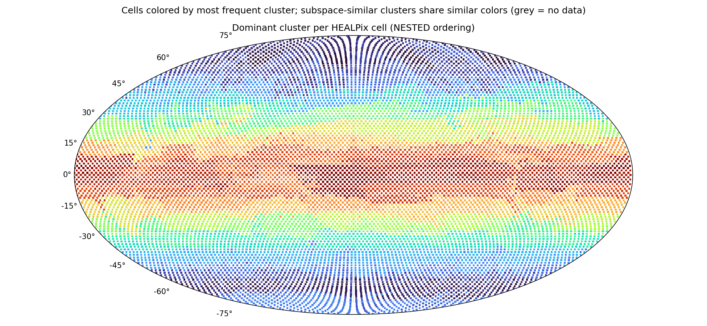

# Subspace clustering report — `subspace_big_d64`

*Generated 2026-06-18 13:36 by `analyze_subspaces.py`. K=128 affine subspaces of dim 64 in 2048-dim token space, 86,016,000 tokens.*

## Configuration

| parameter | value |
|---|---|
| src | latents_2 |
| num_files | 1500 |
| tokens_per_file | 12288 |
| clusters | 128 |
| dim | 64 |
| iters | 25 |
| tol | 0.001 |
| linear | False |
| seed | 0 |
| chunk_size | 262144 |
| gpus | 2 |
| tokens analyzed | 86,016,000 |

## Token sample

- **Sample fingerprint:** `82ca602ed7e7` — runs sharing this fingerprint were clustered on the identical token set and are directly comparable.
- **Files:** 7000 latent files, 12288 tokens each, seed 0.
- **Reproduce this exact sample** for a new run (e.g. to vary K or d):

  ```bash
  python3 subspace_kmeans.py --files-from subspace_big_d64/sample.json --seed 0 --tokens-per-file 12288 \
      --clusters <K> --dim <d> --out <new_dir>
  ```
- File ids (first 20 of 7000, full list in `subspace_big_d64/sample.json`): 0, 1, 6, 8, 9, 10, 11, 12, 13, 14, 16, 18, 19, 21, 22, 24, 25, 26, 27, 28 …

## Convergence

| iter | objective/token | labels changed | min size | max size |
|---|---|---|---|---|
| 1 | 7659.20 | 100.00% | 127 | 23,702,502 |
| 2 | 2341.22 | 77.58% | 1 | 3,982,684 |
| 3 | 2061.09 | 41.54% | 1 | 2,322,971 |
| 4 | 1986.33 | 22.32% | 2 | 1,931,379 |
| 5 | 1956.48 | 14.45% | 1 | 1,857,788 |
| 6 | 1940.54 | 10.50% | 1 | 1,826,473 |
| 7 | 1930.45 | 8.28% | 1 | 1,805,881 |
| 8 | 1923.26 | 6.86% | 1 | 1,786,130 |
| 9 | 1917.89 | 5.78% | 1 | 1,773,980 |
| 10 | 1913.55 | 5.02% | 2 | 1,756,582 |
| 11 | 1909.88 | 4.40% | 1 | 1,746,648 |
| 12 | 1906.88 | 3.87% | 1 | 1,742,497 |
| 13 | 1904.36 | 3.45% | 1 | 1,733,463 |
| 14 | 1902.14 | 3.14% | 1 | 1,725,030 |
| 15 | 1900.28 | 2.85% | 1 | 1,710,312 |
| 16 | 1898.63 | 2.62% | 1 | 1,686,483 |
| 17 | 1897.13 | 2.44% | 1 | 1,657,545 |
| 18 | 1895.78 | 2.25% | 1 | 1,632,698 |
| 19 | 1894.68 | 2.08% | 1 | 1,604,940 |
| 20 | 1893.69 | 1.96% | 1 | 1,567,931 |
| 21 | 1892.75 | 1.84% | 5 | 1,539,840 |
| 22 | 1891.89 | 1.73% | 1 | 1,519,600 |
| 23 | 1891.09 | 1.67% | 1 | 1,479,179 |
| 24 | 1890.26 | 1.58% | 1 | 1,478,181 |
| 25 | 1889.66 | 1.49% | 1 | 1,478,198 |

## Global variance decomposition

Total token variance E‖x−μ_global‖² = **5998**, split into:

- **8.4%** between clusters (the means alone — how much cluster identity explains)
- **60.1%** within clusters, captured by the top-64 subspace directions
- **31.5%** residual (unexplained by the model)

Count-weighted within-cluster EVR(top-64): **0.664**. Dimensions needed for 80% of captured variance: min 28 / median 37 / max 65 (close to 64 ⇒ flat spectrum, consider larger --dim).

## Clusters (sorted by size)

Spatial columns are over the 12288 HEALPix cells with data; `cells@50%` = number of cells holding half the cluster's tokens (low = localized); `owned` = cells where this cluster is the most common label; `files` = share of the 7000 sampled time steps where the cluster appears; `tCV` = coefficient of variation of its share across time deciles (0 = constant in time).

| cluster | tokens | share | EVR(top-64) | d80 | cells@50% | owned | files | tCV |
|---|---|---|---|---|---|---|---|---|
| 27 | 1,478,198 | 1.7% | 0.713 | 32 | 106 | 212 | 100% | 0.00 |
| 66 | 1,460,322 | 1.7% | 0.728 | 31 | 105 | 209 | 100% | 0.00 |
| 50 | 1,355,978 | 1.6% | 0.750 | 29 | 99 | 208 | 100% | 0.01 |
| 78 | 1,201,732 | 1.4% | 0.728 | 29 | 169 | 153 | 100% | 0.06 |
| 74 | 1,171,060 | 1.4% | 0.703 | 34 | 84 | 170 | 100% | 0.00 |
| 114 | 1,139,747 | 1.3% | 0.632 | 39 | 90 | 175 | 100% | 0.06 |
| 42 | 1,108,410 | 1.3% | 0.655 | 36 | 119 | 182 | 100% | 0.04 |
| 6 | 1,094,357 | 1.3% | 0.666 | 34 | 188 | 217 | 100% | 0.06 |
| 17 | 1,079,263 | 1.3% | 0.745 | 30 | 78 | 154 | 100% | 0.00 |
| 39 | 1,044,110 | 1.2% | 0.680 | 33 | 174 | 177 | 100% | 0.04 |
| 119 | 1,031,287 | 1.2% | 0.696 | 32 | 141 | 190 | 100% | 0.04 |
| 117 | 1,025,402 | 1.2% | 0.645 | 38 | 105 | 212 | 100% | 0.06 |
| 4 | 1,023,376 | 1.2% | 0.650 | 37 | 189 | 180 | 100% | 0.05 |
| 85 | 1,001,659 | 1.2% | 0.634 | 39 | 79 | 157 | 100% | 0.07 |
| 125 | 1,000,632 | 1.2% | 0.698 | 33 | 75 | 167 | 100% | 0.02 |
| 35 | 981,117 | 1.1% | 0.714 | 34 | 71 | 145 | 100% | 0.00 |
| 93 | 941,493 | 1.1% | 0.765 | 30 | 68 | 136 | 100% | 0.00 |
| 86 | 941,407 | 1.1% | 0.635 | 38 | 105 | 165 | 100% | 0.06 |
| 83 | 932,810 | 1.1% | 0.739 | 31 | 71 | 151 | 100% | 0.01 |
| 70 | 919,353 | 1.1% | 0.686 | 34 | 106 | 212 | 100% | 0.03 |
| 56 | 907,862 | 1.1% | 0.718 | 34 | 65 | 132 | 100% | 0.00 |
| 99 | 899,834 | 1.0% | 0.627 | 38 | 105 | 180 | 100% | 0.05 |
| 0 | 899,110 | 1.0% | 0.723 | 33 | 64 | 129 | 100% | 0.00 |
| 61 | 898,252 | 1.0% | 0.644 | 37 | 68 | 147 | 100% | 0.03 |
| 88 | 883,911 | 1.0% | 0.663 | 34 | 146 | 139 | 100% | 0.11 |
| 126 | 864,804 | 1.0% | 0.631 | 38 | 109 | 189 | 97% | 0.17 |
| 43 | 847,542 | 1.0% | 0.690 | 30 | 191 | 122 | 97% | 0.12 |
| 21 | 845,765 | 1.0% | 0.715 | 37 | 61 | 121 | 100% | 0.00 |
| 82 | 842,453 | 1.0% | 0.632 | 37 | 177 | 142 | 82% | 0.15 |
| 67 | 835,690 | 1.0% | 0.625 | 38 | 169 | 171 | 100% | 0.21 |
| 58 | 834,029 | 1.0% | 0.642 | 37 | 132 | 116 | 100% | 0.08 |
| 121 | 825,209 | 1.0% | 0.687 | 32 | 90 | 142 | 100% | 0.08 |
| 10 | 821,282 | 1.0% | 0.692 | 35 | 68 | 148 | 100% | 0.02 |
| 76 | 816,959 | 0.9% | 0.668 | 33 | 108 | 121 | 100% | 0.05 |
| 105 | 815,422 | 0.9% | 0.590 | 39 | 76 | 125 | 100% | 0.05 |
| 34 | 811,525 | 0.9% | 0.634 | 36 | 89 | 68 | 100% | 0.11 |
| 75 | 805,992 | 0.9% | 0.611 | 39 | 102 | 180 | 100% | 0.10 |
| 60 | 805,468 | 0.9% | 0.628 | 37 | 169 | 116 | 100% | 0.11 |
| 89 | 803,782 | 0.9% | 0.651 | 37 | 58 | 116 | 100% | 0.00 |
| 33 | 800,505 | 0.9% | 0.647 | 37 | 176 | 130 | 100% | 0.08 |
| 111 | 788,869 | 0.9% | 0.718 | 29 | 252 | 21 | 100% | 0.02 |
| 107 | 786,495 | 0.9% | 0.706 | 33 | 66 | 139 | 100% | 0.01 |
| 1 | 780,614 | 0.9% | 0.612 | 38 | 82 | 126 | 100% | 0.13 |
| 41 | 778,361 | 0.9% | 0.664 | 33 | 349 | 6 | 100% | 0.06 |
| 95 | 772,026 | 0.9% | 0.659 | 36 | 146 | 128 | 100% | 0.11 |
| 113 | 762,784 | 0.9% | 0.700 | 28 | 145 | 96 | 100% | 0.06 |
| 25 | 758,333 | 0.9% | 0.702 | 35 | 55 | 110 | 100% | 0.00 |
| 127 | 741,281 | 0.9% | 0.774 | 33 | 53 | 108 | 100% | 0.00 |
| 115 | 728,943 | 0.8% | 0.644 | 36 | 57 | 125 | 100% | 0.03 |
| 90 | 726,782 | 0.8% | 0.703 | 35 | 52 | 117 | 100% | 0.01 |
| 59 | 723,254 | 0.8% | 0.695 | 35 | 60 | 125 | 100% | 0.01 |
| 18 | 721,229 | 0.8% | 0.665 | 32 | 222 | 42 | 100% | 0.03 |
| 48 | 713,321 | 0.8% | 0.601 | 39 | 158 | 83 | 100% | 0.15 |
| 110 | 710,479 | 0.8% | 0.662 | 38 | 57 | 133 | 100% | 0.03 |
| 5 | 701,999 | 0.8% | 0.640 | 37 | 263 | 19 | 100% | 0.05 |
| 80 | 700,085 | 0.8% | 0.732 | 35 | 51 | 101 | 100% | 0.00 |
| 73 | 698,614 | 0.8% | 0.610 | 38 | 195 | 71 | 89% | 0.13 |
| 52 | 697,128 | 0.8% | 0.657 | 34 | 163 | 89 | 90% | 0.13 |
| 98 | 692,746 | 0.8% | 0.674 | 31 | 309 | 0 | 100% | 0.04 |
| 16 | 684,538 | 0.8% | 0.666 | 35 | 50 | 100 | 100% | 0.01 |
| 26 | 682,347 | 0.8% | 0.605 | 40 | 145 | 84 | 100% | 0.08 |
| 71 | 672,429 | 0.8% | 0.626 | 38 | 111 | 130 | 100% | 0.13 |
| 22 | 672,176 | 0.8% | 0.606 | 39 | 105 | 98 | 100% | 0.07 |
| 123 | 669,338 | 0.8% | 0.772 | 31 | 48 | 96 | 100% | 0.00 |
| 9 | 668,359 | 0.8% | 0.633 | 38 | 111 | 145 | 100% | 0.12 |
| 19 | 661,401 | 0.8% | 0.647 | 37 | 62 | 112 | 100% | 0.06 |
| 46 | 660,932 | 0.8% | 0.651 | 38 | 50 | 91 | 100% | 0.08 |
| 30 | 660,465 | 0.8% | 0.635 | 38 | 140 | 27 | 95% | 0.13 |
| 53 | 659,102 | 0.8% | 0.624 | 38 | 60 | 90 | 100% | 0.05 |
| 11 | 650,914 | 0.8% | 0.641 | 35 | 89 | 82 | 98% | 0.08 |
| 84 | 626,275 | 0.7% | 0.617 | 38 | 97 | 92 | 100% | 0.09 |
| 68 | 610,561 | 0.7% | 0.665 | 37 | 48 | 93 | 100% | 0.05 |
| 54 | 610,464 | 0.7% | 0.604 | 39 | 199 | 47 | 100% | 0.06 |
| 106 | 593,973 | 0.7% | 0.617 | 39 | 163 | 38 | 100% | 0.08 |
| 100 | 582,939 | 0.7% | 0.609 | 38 | 131 | 73 | 88% | 0.19 |
| 15 | 582,024 | 0.7% | 0.601 | 39 | 46 | 92 | 100% | 0.04 |
| 24 | 579,339 | 0.7% | 0.613 | 37 | 101 | 77 | 72% | 0.15 |
| 64 | 574,400 | 0.7% | 0.592 | 38 | 81 | 51 | 87% | 0.15 |
| 29 | 573,945 | 0.7% | 0.623 | 38 | 90 | 87 | 73% | 0.13 |
| 104 | 572,306 | 0.7% | 0.616 | 38 | 107 | 89 | 94% | 0.14 |
| 120 | 566,048 | 0.7% | 0.649 | 39 | 45 | 92 | 100% | 0.06 |
| 12 | 565,276 | 0.7% | 0.638 | 38 | 69 | 78 | 100% | 0.08 |
| 45 | 558,198 | 0.6% | 0.624 | 38 | 103 | 96 | 100% | 0.08 |
| 7 | 556,068 | 0.6% | 0.610 | 38 | 156 | 18 | 99% | 0.13 |
| 94 | 543,046 | 0.6% | 0.717 | 29 | 155 | 27 | 100% | 0.06 |
| 101 | 541,428 | 0.6% | 0.619 | 38 | 147 | 84 | 100% | 0.09 |
| 31 | 524,425 | 0.6% | 0.615 | 38 | 149 | 33 | 100% | 0.09 |
| 23 | 517,622 | 0.6% | 0.611 | 40 | 53 | 56 | 100% | 0.08 |
| 13 | 516,644 | 0.6% | 0.621 | 36 | 537 | 0 | 100% | 0.08 |
| 91 | 512,341 | 0.6% | 0.642 | 37 | 39 | 75 | 100% | 0.03 |
| 40 | 500,456 | 0.6% | 0.607 | 39 | 149 | 45 | 100% | 0.07 |
| 57 | 496,922 | 0.6% | 0.624 | 38 | 180 | 25 | 99% | 0.11 |
| 81 | 496,427 | 0.6% | 0.660 | 36 | 36 | 76 | 100% | 0.01 |
| 3 | 495,026 | 0.6% | 0.649 | 38 | 37 | 74 | 100% | 0.02 |
| 36 | 494,835 | 0.6% | 0.632 | 36 | 273 | 0 | 100% | 0.07 |
| 97 | 482,749 | 0.6% | 0.626 | 39 | 44 | 84 | 100% | 0.04 |
| 8 | 481,913 | 0.6% | 0.636 | 38 | 40 | 83 | 100% | 0.05 |
| 87 | 473,689 | 0.6% | 0.665 | 36 | 34 | 69 | 100% | 0.01 |
| 47 | 469,527 | 0.5% | 0.648 | 38 | 34 | 70 | 100% | 0.03 |
| 108 | 465,933 | 0.5% | 0.631 | 38 | 60 | 88 | 100% | 0.10 |
| 124 | 461,084 | 0.5% | 0.713 | 36 | 34 | 70 | 100% | 0.00 |
| 44 | 459,651 | 0.5% | 0.644 | 38 | 42 | 70 | 100% | 0.11 |
| 118 | 448,523 | 0.5% | 0.604 | 40 | 34 | 70 | 100% | 0.06 |
| 51 | 448,206 | 0.5% | 0.655 | 37 | 33 | 69 | 100% | 0.02 |
| 102 | 406,939 | 0.5% | 0.631 | 37 | 57 | 53 | 98% | 0.09 |
| 77 | 405,378 | 0.5% | 0.781 | 32 | 30 | 59 | 100% | 0.00 |
| 72 | 398,986 | 0.5% | 0.622 | 40 | 29 | 61 | 100% | 0.02 |
| 20 | 395,901 | 0.5% | 0.674 | 34 | 29 | 45 | 100% | 0.03 |
| 69 | 393,048 | 0.5% | 0.663 | 37 | 32 | 77 | 100% | 0.02 |
| 103 | 384,949 | 0.4% | 0.617 | 39 | 43 | 66 | 100% | 0.10 |
| 55 | 377,770 | 0.4% | 0.697 | 34 | 26 | 44 | 100% | 0.02 |
| 96 | 373,790 | 0.4% | 0.667 | 37 | 28 | 55 | 100% | 0.03 |
| 122 | 369,689 | 0.4% | 0.650 | 33 | 265 | 3 | 100% | 0.07 |
| 14 | 369,164 | 0.4% | 0.755 | 34 | 27 | 55 | 100% | 0.01 |
| 116 | 351,981 | 0.4% | 0.644 | 37 | 45 | 42 | 100% | 0.09 |
| 112 | 350,053 | 0.4% | 0.645 | 40 | 27 | 57 | 100% | 0.02 |
| 37 | 349,382 | 0.4% | 0.633 | 40 | 29 | 57 | 100% | 0.07 |
| 62 | 345,346 | 0.4% | 0.668 | 36 | 25 | 51 | 100% | 0.01 |
| 32 | 341,312 | 0.4% | 0.671 | 36 | 25 | 51 | 100% | 0.01 |
| 109 | 326,805 | 0.4% | 0.653 | 38 | 24 | 40 | 100% | 0.07 |
| 92 | 324,124 | 0.4% | 0.632 | 40 | 24 | 45 | 100% | 0.02 |
| 49 | 322,522 | 0.4% | 0.716 | 34 | 24 | 52 | 100% | 0.02 |
| 63 | 308,635 | 0.4% | 0.679 | 36 | 23 | 46 | 100% | 0.02 |
| 79 | 290,794 | 0.3% | 0.651 | 38 | 21 | 42 | 100% | 0.00 |
| 2 | 266,121 | 0.3% | 0.672 | 38 | 19 | 37 | 100% | 0.00 |
| 38 | 230,740 | 0.3% | 0.640 | 40 | 18 | 32 | 100% | 0.03 |
| 28 | 227,854 | 0.3% | 0.729 | 34 | 17 | 27 | 100% | 0.04 |
| 65 | 1 | 0.0% | 0.000 | 65 | 1 | 0 | 0% | 3.16 |

## Subspace affinity between clusters

Affinity(i,j) = ‖Uᵢᵀ·Uⱼ‖²_F / 64 ∈ [0,1]: mean squared cosine of the principal angles between the two subspaces (1 = identical span, 0 = orthogonal). High-affinity pairs are candidates for merging (K may be too large); uniformly low values mean genuinely distinct regimes.

Off-diagonal affinity: median 0.416, mean 0.425, max 0.806.

| pair | subspace affinity | mean-vector cosine |
|---|---|---|
| 30 ↔ 126 | 0.806 | 0.447 |
| 85 ↔ 126 | 0.802 | 0.724 |
| 114 ↔ 117 | 0.799 | 0.718 |
| 120 ↔ 126 | 0.799 | 0.431 |
| 110 ↔ 117 | 0.791 | 0.699 |
| 10 ↔ 59 | 0.787 | 0.745 |
| 5 ↔ 33 | 0.785 | 0.312 |
| 68 ↔ 117 | 0.781 | 0.709 |
| 44 ↔ 126 | 0.781 | 0.430 |
| 26 ↔ 48 | 0.780 | 0.775 |
| 85 ↔ 114 | 0.775 | 0.717 |
| 58 ↔ 86 | 0.773 | 0.538 |

## Most time-varying clusters

Enrichment of each cluster per time decile of the dataset (file index 0…13020; 1.00 = the cluster's average rate). Values ≫1 mark the periods where the cluster concentrates — a strong seasonal/temporal signature.

| cluster | tCV | D0 | D1 | D2 | D3 | D4 | D5 | D6 | D7 | D8 | D9 |
|---|---|---|---|---|---|---|---|---|---|---|---|
| 65 | 3.16 | 0.00 | 0.00 | 0.00 | 0.00 | 0.00 | 0.00 | 0.00 | 0.00 | 0.00 | 9.96 |
| 67 | 0.21 | 0.92 | 1.04 | 1.42 | 1.06 | 0.93 | 1.29 | 1.00 | 0.87 | 0.71 | 0.85 |
| 100 | 0.19 | 0.98 | 1.09 | 1.34 | 0.98 | 0.98 | 1.19 | 1.11 | 0.83 | 0.70 | 0.78 |
| 126 | 0.17 | 0.96 | 0.72 | 0.82 | 0.96 | 1.00 | 0.90 | 1.04 | 1.20 | 1.11 | 1.28 |
| 48 | 0.15 | 0.99 | 1.02 | 1.26 | 1.17 | 0.95 | 1.07 | 1.05 | 0.87 | 0.89 | 0.73 |
| 64 | 0.15 | 0.95 | 1.00 | 1.06 | 1.24 | 1.15 | 1.09 | 1.05 | 0.87 | 0.77 | 0.82 |
| 24 | 0.15 | 1.05 | 1.01 | 0.87 | 0.79 | 0.81 | 0.92 | 1.08 | 1.11 | 1.21 | 1.16 |
| 82 | 0.15 | 1.04 | 1.00 | 0.81 | 0.82 | 0.86 | 0.94 | 1.05 | 1.14 | 1.19 | 1.19 |

## World map



Each of the 12,288 HEALPix cells is colored by its most frequent cluster (grey = no data). Cell indices use **NESTED HEALPix ordering** (confirmed: geographically coherent continent-scale regions appear under NESTED, incoherent stripes under RING). Colors are assigned by spectral ordering of the subspace-affinity matrix, so subspace-similar clusters share similar hues — real regions read as smooth gradients, genuine noise stays speckled.

## Interpretation notes

- *Localized + present in ~100% of files* (low `cells@50%`, `files` ≈ 100%) ⇒ the cluster is a **geographic regime** (region/surface type), stable in time.
- *High `tCV` with smooth decile profile* ⇒ **seasonal or trend** behaviour; check the decile table above.
- *EVR near the global average with d80 ≈ d* ⇒ the subspace dimension truncates the spectrum; re-run with larger `--dim` to capture more structure.
- Subspace bases live in `model.pt['U']` `[K, 2048, d]` (orthonormal columns, descending eigenvalue order); project tokens with `(x-μ_j) @ U_j`.
