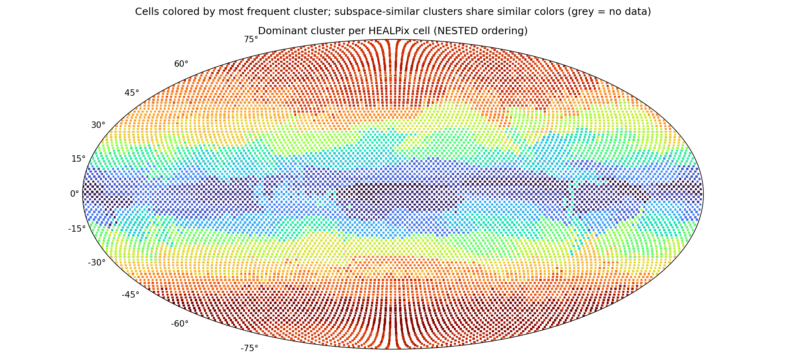

# Subspace clustering report — `subspace_big_i100`

*Generated 2026-06-12 15:22 by `analyze_subspaces.py`. K=128 affine subspaces of dim 32 in 2048-dim token space, 86,016,000 tokens.*

## Configuration

| parameter | value |
|---|---|
| src | latents_2 |
| num_files | 1500 |
| tokens_per_file | 12288 |
| clusters | 128 |
| dim | 32 |
| iters | 100 |
| tol | 0.001 |
| linear | False |
| seed | 0 |
| chunk_size | 262144 |
| gpus | 2 |
| tokens analyzed | 86,016,000 |

## Token sample

- **Sample fingerprint:** `82ca602ed7e7` — runs sharing this fingerprint were clustered on the identical token set and are directly comparable.
- **Files:** 7000 latent files, 12288 tokens each, seed 0.
- **Reproduce this exact sample** for a new run (e.g. to vary K or d):

  ```bash
  python3 subspace_kmeans.py --files-from subspace_big_i100/sample.json --seed 0 --tokens-per-file 12288 \
      --clusters <K> --dim <d> --out <new_dir>
  ```
- File ids (first 20 of 7000, full list in `subspace_big_i100/sample.json`): 0, 1, 6, 8, 9, 10, 11, 12, 13, 14, 16, 18, 19, 21, 22, 24, 25, 26, 27, 28 …

## Convergence

| iter | objective/token | labels changed | min size | max size |
|---|---|---|---|---|
| 1 | 7659.20 | 100.00% | 127 | 23,702,502 |
| 2 | 3092.84 | 74.64% | 2,108 | 5,171,010 |
| 3 | 2834.43 | 40.86% | 31,953 | 2,312,301 |
| 4 | 2765.63 | 22.33% | 125,563 | 1,977,172 |
| 5 | 2737.22 | 14.81% | 156,615 | 1,676,012 |
| 6 | 2722.19 | 10.95% | 171,476 | 1,581,330 |
| 7 | 2712.85 | 8.58% | 182,258 | 1,531,793 |
| 8 | 2706.53 | 6.97% | 188,586 | 1,491,608 |
| 9 | 2701.97 | 5.87% | 193,709 | 1,457,367 |
| 10 | 2698.40 | 5.10% | 198,848 | 1,444,461 |
| 11 | 2695.57 | 4.51% | 205,626 | 1,421,788 |
| 12 | 2693.21 | 4.09% | 210,482 | 1,395,454 |
| 13 | 2691.12 | 3.74% | 214,633 | 1,380,268 |
| 14 | 2689.34 | 3.40% | 219,147 | 1,375,497 |
| 15 | 2687.80 | 3.11% | 220,110 | 1,376,128 |
| 16 | 2686.40 | 2.87% | 219,939 | 1,378,148 |
| 17 | 2685.20 | 2.65% | 219,637 | 1,379,993 |
| 18 | 2684.18 | 2.46% | 219,318 | 1,381,436 |
| 19 | 2683.30 | 2.29% | 219,277 | 1,382,534 |
| 20 | 2682.55 | 2.13% | 219,580 | 1,383,572 |
| 21 | 2681.86 | 2.01% | 220,328 | 1,384,443 |
| 22 | 2681.22 | 1.89% | 221,170 | 1,385,269 |
| 23 | 2680.70 | 1.78% | 221,624 | 1,385,951 |
| 24 | 2680.22 | 1.67% | 221,293 | 1,386,489 |
| 25 | 2679.79 | 1.58% | 221,704 | 1,386,832 |
| 26 | 2679.41 | 1.49% | 222,946 | 1,387,125 |
| 27 | 2679.08 | 1.40% | 223,158 | 1,387,333 |
| 28 | 2678.79 | 1.34% | 223,219 | 1,387,562 |
| 29 | 2678.52 | 1.29% | 223,006 | 1,387,824 |
| 30 | 2678.27 | 1.24% | 222,595 | 1,388,035 |
| 31 | 2678.04 | 1.20% | 222,159 | 1,388,176 |
| 32 | 2677.80 | 1.16% | 221,891 | 1,388,363 |
| 33 | 2677.58 | 1.13% | 221,652 | 1,388,315 |
| 34 | 2677.37 | 1.08% | 221,451 | 1,388,330 |
| 35 | 2677.18 | 1.03% | 220,864 | 1,388,221 |
| 36 | 2677.02 | 1.00% | 220,097 | 1,388,220 |
| 37 | 2676.87 | 0.97% | 219,465 | 1,388,135 |
| 38 | 2676.71 | 0.95% | 218,948 | 1,388,079 |
| 39 | 2676.55 | 0.94% | 218,530 | 1,388,031 |
| 40 | 2676.39 | 0.92% | 218,161 | 1,388,056 |
| 41 | 2676.25 | 0.90% | 217,922 | 1,388,071 |
| 42 | 2676.12 | 0.87% | 217,696 | 1,388,160 |
| 43 | 2675.97 | 0.85% | 217,533 | 1,388,256 |
| 44 | 2675.87 | 0.83% | 217,378 | 1,388,420 |
| 45 | 2675.74 | 0.81% | 217,286 | 1,388,574 |
| 46 | 2675.65 | 0.79% | 217,207 | 1,388,703 |
| 47 | 2675.52 | 0.78% | 217,148 | 1,388,759 |
| 48 | 2675.41 | 0.76% | 217,101 | 1,388,789 |
| 49 | 2675.30 | 0.75% | 217,187 | 1,388,767 |
| 50 | 2675.20 | 0.74% | 217,440 | 1,388,703 |
| 51 | 2675.10 | 0.72% | 218,074 | 1,388,669 |
| 52 | 2675.00 | 0.71% | 218,285 | 1,388,596 |
| 53 | 2674.91 | 0.69% | 218,046 | 1,388,480 |
| 54 | 2674.81 | 0.68% | 217,828 | 1,388,403 |
| 55 | 2674.73 | 0.66% | 217,690 | 1,388,314 |
| 56 | 2674.63 | 0.65% | 217,603 | 1,388,264 |
| 57 | 2674.55 | 0.64% | 217,568 | 1,388,224 |
| 58 | 2674.48 | 0.62% | 217,676 | 1,388,175 |
| 59 | 2674.41 | 0.62% | 217,966 | 1,388,181 |
| 60 | 2674.34 | 0.61% | 218,547 | 1,388,192 |
| 61 | 2674.25 | 0.60% | 219,487 | 1,388,220 |
| 62 | 2674.18 | 0.59% | 220,655 | 1,388,265 |
| 63 | 2674.11 | 0.58% | 221,405 | 1,388,292 |
| 64 | 2674.05 | 0.57% | 221,682 | 1,388,342 |
| 65 | 2673.98 | 0.56% | 221,842 | 1,388,419 |
| 66 | 2673.91 | 0.56% | 221,883 | 1,388,467 |
| 67 | 2673.86 | 0.55% | 221,871 | 1,388,515 |
| 68 | 2673.79 | 0.55% | 221,830 | 1,388,608 |
| 69 | 2673.74 | 0.54% | 221,820 | 1,388,696 |
| 70 | 2673.68 | 0.54% | 221,831 | 1,388,768 |
| 71 | 2673.61 | 0.53% | 221,903 | 1,388,802 |
| 72 | 2673.57 | 0.53% | 221,991 | 1,388,850 |
| 73 | 2673.52 | 0.53% | 222,065 | 1,388,889 |
| 74 | 2673.45 | 0.53% | 222,165 | 1,388,951 |
| 75 | 2673.41 | 0.52% | 222,249 | 1,389,015 |
| 76 | 2673.34 | 0.52% | 222,394 | 1,389,009 |
| 77 | 2673.29 | 0.52% | 222,592 | 1,389,012 |
| 78 | 2673.22 | 0.51% | 222,823 | 1,389,023 |
| 79 | 2673.17 | 0.51% | 223,071 | 1,389,019 |
| 80 | 2673.11 | 0.50% | 223,405 | 1,389,035 |
| 81 | 2673.05 | 0.49% | 223,743 | 1,389,072 |
| 82 | 2673.01 | 0.49% | 224,090 | 1,389,079 |
| 83 | 2672.95 | 0.48% | 224,490 | 1,389,100 |
| 84 | 2672.92 | 0.48% | 224,818 | 1,389,097 |
| 85 | 2672.85 | 0.48% | 225,083 | 1,389,071 |
| 86 | 2672.80 | 0.48% | 225,522 | 1,389,056 |
| 87 | 2672.74 | 0.48% | 226,222 | 1,389,021 |
| 88 | 2672.68 | 0.49% | 227,225 | 1,389,000 |
| 89 | 2672.60 | 0.49% | 228,213 | 1,388,970 |
| 90 | 2672.54 | 0.49% | 228,632 | 1,388,942 |
| 91 | 2672.47 | 0.49% | 228,674 | 1,388,902 |
| 92 | 2672.40 | 0.49% | 228,686 | 1,388,927 |
| 93 | 2672.32 | 0.48% | 228,749 | 1,388,933 |
| 94 | 2672.24 | 0.47% | 228,846 | 1,388,934 |
| 95 | 2672.19 | 0.45% | 229,016 | 1,388,917 |
| 96 | 2672.12 | 0.44% | 229,230 | 1,388,946 |
| 97 | 2672.09 | 0.43% | 229,527 | 1,388,945 |
| 98 | 2672.05 | 0.41% | 229,840 | 1,388,956 |
| 99 | 2672.02 | 0.39% | 230,208 | 1,388,976 |
| 100 | 2671.99 | 0.37% | 230,634 | 1,388,995 |

## Global variance decomposition

Total token variance E‖x−μ_global‖² = **5998**, split into:

- **10.2%** between clusters (the means alone — how much cluster identity explains)
- **45.3%** within clusters, captured by the top-32 subspace directions
- **44.5%** residual (unexplained by the model)

Count-weighted within-cluster EVR(top-32): **0.513**. Dimensions needed for 80% of captured variance: min 17 / median 20 / max 22 (close to 32 ⇒ flat spectrum, consider larger --dim).

## Clusters (sorted by size)

Spatial columns are over the 12288 HEALPix cells with data; `cells@50%` = number of cells holding half the cluster's tokens (low = localized); `owned` = cells where this cluster is the most common label; `files` = share of the 7000 sampled time steps where the cluster appears; `tCV` = coefficient of variation of its share across time deciles (0 = constant in time).

| cluster | tokens | share | EVR(top-32) | d80 | cells@50% | owned | files | tCV |
|---|---|---|---|---|---|---|---|---|
| 27 | 1,388,995 | 1.6% | 0.577 | 19 | 100 | 203 | 100% | 0.00 |
| 66 | 1,296,134 | 1.5% | 0.605 | 18 | 93 | 186 | 100% | 0.00 |
| 4 | 1,116,025 | 1.3% | 0.506 | 21 | 282 | 253 | 100% | 0.05 |
| 80 | 1,079,174 | 1.3% | 0.557 | 19 | 117 | 237 | 100% | 0.08 |
| 14 | 1,073,228 | 1.2% | 0.504 | 20 | 276 | 139 | 100% | 0.05 |
| 39 | 1,072,871 | 1.2% | 0.532 | 19 | 311 | 316 | 100% | 0.03 |
| 17 | 1,056,263 | 1.2% | 0.595 | 18 | 124 | 181 | 100% | 0.05 |
| 83 | 1,022,055 | 1.2% | 0.573 | 18 | 285 | 161 | 100% | 0.03 |
| 117 | 1,000,571 | 1.2% | 0.486 | 22 | 180 | 206 | 100% | 0.04 |
| 78 | 990,355 | 1.2% | 0.622 | 17 | 175 | 270 | 100% | 0.03 |
| 90 | 977,719 | 1.1% | 0.529 | 19 | 133 | 216 | 98% | 0.08 |
| 107 | 963,528 | 1.1% | 0.531 | 19 | 364 | 89 | 100% | 0.04 |
| 121 | 959,524 | 1.1% | 0.579 | 17 | 248 | 260 | 100% | 0.10 |
| 59 | 948,690 | 1.1% | 0.505 | 20 | 338 | 122 | 100% | 0.03 |
| 70 | 940,039 | 1.1% | 0.533 | 20 | 275 | 237 | 100% | 0.05 |
| 127 | 915,816 | 1.1% | 0.587 | 17 | 349 | 92 | 100% | 0.06 |
| 42 | 908,425 | 1.1% | 0.503 | 20 | 216 | 194 | 100% | 0.09 |
| 110 | 904,386 | 1.1% | 0.477 | 22 | 234 | 90 | 100% | 0.12 |
| 68 | 902,605 | 1.0% | 0.536 | 19 | 328 | 124 | 100% | 0.07 |
| 34 | 899,258 | 1.0% | 0.492 | 20 | 200 | 56 | 95% | 0.16 |
| 18 | 888,152 | 1.0% | 0.516 | 19 | 301 | 81 | 100% | 0.03 |
| 50 | 884,120 | 1.0% | 0.611 | 18 | 129 | 113 | 100% | 0.06 |
| 99 | 882,012 | 1.0% | 0.491 | 21 | 256 | 177 | 100% | 0.08 |
| 76 | 876,223 | 1.0% | 0.527 | 19 | 429 | 42 | 100% | 0.05 |
| 21 | 875,116 | 1.0% | 0.610 | 18 | 63 | 127 | 100% | 0.00 |
| 74 | 873,550 | 1.0% | 0.573 | 19 | 77 | 173 | 100% | 0.05 |
| 10 | 867,783 | 1.0% | 0.568 | 18 | 460 | 40 | 100% | 0.05 |
| 93 | 858,669 | 1.0% | 0.626 | 18 | 75 | 170 | 100% | 0.05 |
| 37 | 853,277 | 1.0% | 0.481 | 22 | 189 | 178 | 98% | 0.15 |
| 35 | 844,416 | 1.0% | 0.556 | 20 | 61 | 131 | 100% | 0.03 |
| 114 | 830,198 | 1.0% | 0.479 | 22 | 139 | 162 | 100% | 0.06 |
| 6 | 825,791 | 1.0% | 0.502 | 20 | 317 | 115 | 100% | 0.09 |
| 86 | 817,470 | 1.0% | 0.499 | 21 | 271 | 40 | 92% | 0.12 |
| 11 | 815,892 | 0.9% | 0.503 | 20 | 245 | 84 | 100% | 0.04 |
| 20 | 815,540 | 0.9% | 0.531 | 19 | 442 | 8 | 100% | 0.11 |
| 85 | 809,508 | 0.9% | 0.471 | 22 | 120 | 147 | 99% | 0.15 |
| 46 | 786,430 | 0.9% | 0.481 | 22 | 174 | 189 | 100% | 0.07 |
| 52 | 776,059 | 0.9% | 0.503 | 20 | 297 | 85 | 97% | 0.10 |
| 69 | 775,111 | 0.9% | 0.506 | 20 | 256 | 103 | 100% | 0.11 |
| 67 | 774,017 | 0.9% | 0.472 | 22 | 219 | 129 | 96% | 0.24 |
| 41 | 772,777 | 0.9% | 0.530 | 19 | 501 | 5 | 100% | 0.03 |
| 81 | 769,418 | 0.9% | 0.493 | 20 | 77 | 140 | 100% | 0.08 |
| 82 | 767,241 | 0.9% | 0.487 | 21 | 254 | 126 | 85% | 0.14 |
| 43 | 761,791 | 0.9% | 0.548 | 18 | 258 | 147 | 96% | 0.13 |
| 94 | 751,578 | 0.9% | 0.580 | 17 | 314 | 10 | 100% | 0.03 |
| 56 | 747,067 | 0.9% | 0.593 | 18 | 56 | 118 | 100% | 0.01 |
| 120 | 746,766 | 0.9% | 0.485 | 22 | 112 | 163 | 94% | 0.15 |
| 16 | 737,366 | 0.9% | 0.504 | 20 | 55 | 112 | 100% | 0.02 |
| 33 | 726,982 | 0.8% | 0.501 | 21 | 370 | 77 | 100% | 0.07 |
| 1 | 726,754 | 0.8% | 0.464 | 22 | 215 | 64 | 100% | 0.06 |
| 111 | 725,034 | 0.8% | 0.583 | 17 | 329 | 30 | 100% | 0.03 |
| 45 | 723,436 | 0.8% | 0.472 | 22 | 178 | 166 | 100% | 0.08 |
| 48 | 719,823 | 0.8% | 0.448 | 22 | 241 | 79 | 100% | 0.18 |
| 12 | 714,050 | 0.8% | 0.485 | 22 | 93 | 99 | 100% | 0.07 |
| 71 | 712,345 | 0.8% | 0.465 | 22 | 129 | 156 | 100% | 0.10 |
| 126 | 711,652 | 0.8% | 0.467 | 22 | 109 | 135 | 100% | 0.26 |
| 100 | 709,168 | 0.8% | 0.471 | 22 | 195 | 46 | 92% | 0.18 |
| 84 | 708,865 | 0.8% | 0.460 | 22 | 191 | 123 | 100% | 0.05 |
| 113 | 708,616 | 0.8% | 0.538 | 18 | 377 | 27 | 100% | 0.03 |
| 5 | 705,774 | 0.8% | 0.491 | 21 | 356 | 21 | 100% | 0.07 |
| 115 | 700,604 | 0.8% | 0.493 | 20 | 75 | 143 | 100% | 0.07 |
| 73 | 693,868 | 0.8% | 0.447 | 22 | 253 | 118 | 100% | 0.11 |
| 58 | 687,390 | 0.8% | 0.466 | 22 | 182 | 83 | 100% | 0.09 |
| 60 | 678,692 | 0.8% | 0.463 | 21 | 182 | 106 | 100% | 0.10 |
| 61 | 662,411 | 0.8% | 0.474 | 21 | 93 | 128 | 80% | 0.12 |
| 3 | 650,241 | 0.8% | 0.488 | 22 | 64 | 102 | 100% | 0.06 |
| 95 | 644,800 | 0.7% | 0.504 | 20 | 286 | 72 | 97% | 0.12 |
| 125 | 636,192 | 0.7% | 0.559 | 18 | 115 | 88 | 100% | 0.09 |
| 57 | 630,025 | 0.7% | 0.488 | 21 | 137 | 103 | 88% | 0.08 |
| 119 | 629,023 | 0.7% | 0.526 | 18 | 467 | 3 | 100% | 0.03 |
| 65 | 616,747 | 0.7% | 0.465 | 21 | 180 | 75 | 91% | 0.14 |
| 29 | 612,471 | 0.7% | 0.497 | 20 | 128 | 126 | 76% | 0.14 |
| 105 | 612,333 | 0.7% | 0.438 | 22 | 86 | 103 | 100% | 0.05 |
| 22 | 611,642 | 0.7% | 0.454 | 21 | 368 | 4 | 100% | 0.07 |
| 77 | 610,598 | 0.7% | 0.602 | 19 | 44 | 87 | 100% | 0.00 |
| 64 | 609,173 | 0.7% | 0.440 | 21 | 98 | 69 | 90% | 0.15 |
| 63 | 606,909 | 0.7% | 0.518 | 18 | 398 | 0 | 100% | 0.06 |
| 9 | 606,117 | 0.7% | 0.461 | 22 | 111 | 111 | 87% | 0.15 |
| 124 | 605,052 | 0.7% | 0.514 | 20 | 62 | 115 | 100% | 0.03 |
| 54 | 599,138 | 0.7% | 0.452 | 21 | 251 | 26 | 100% | 0.11 |
| 19 | 595,591 | 0.7% | 0.501 | 20 | 71 | 118 | 100% | 0.10 |
| 15 | 584,131 | 0.7% | 0.445 | 22 | 49 | 102 | 100% | 0.03 |
| 106 | 582,081 | 0.7% | 0.463 | 21 | 298 | 32 | 100% | 0.08 |
| 30 | 578,422 | 0.7% | 0.488 | 22 | 136 | 24 | 96% | 0.20 |
| 98 | 575,581 | 0.7% | 0.579 | 17 | 438 | 6 | 100% | 0.06 |
| 47 | 573,918 | 0.7% | 0.495 | 20 | 81 | 66 | 97% | 0.13 |
| 101 | 557,835 | 0.6% | 0.469 | 22 | 190 | 84 | 98% | 0.14 |
| 44 | 557,043 | 0.6% | 0.485 | 22 | 103 | 134 | 99% | 0.11 |
| 7 | 553,266 | 0.6% | 0.471 | 21 | 220 | 21 | 100% | 0.11 |
| 88 | 545,556 | 0.6% | 0.515 | 20 | 44 | 94 | 100% | 0.04 |
| 87 | 533,496 | 0.6% | 0.504 | 20 | 40 | 86 | 100% | 0.01 |
| 104 | 533,271 | 0.6% | 0.468 | 21 | 114 | 81 | 95% | 0.15 |
| 0 | 529,945 | 0.6% | 0.601 | 20 | 38 | 76 | 100% | 0.00 |
| 25 | 527,495 | 0.6% | 0.569 | 19 | 38 | 84 | 100% | 0.02 |
| 40 | 518,152 | 0.6% | 0.449 | 22 | 219 | 40 | 100% | 0.07 |
| 36 | 515,319 | 0.6% | 0.471 | 20 | 288 | 16 | 99% | 0.11 |
| 26 | 514,639 | 0.6% | 0.456 | 22 | 99 | 60 | 94% | 0.16 |
| 97 | 511,843 | 0.6% | 0.473 | 21 | 61 | 112 | 100% | 0.07 |
| 8 | 502,243 | 0.6% | 0.467 | 22 | 49 | 102 | 100% | 0.05 |
| 102 | 501,329 | 0.6% | 0.488 | 20 | 74 | 88 | 100% | 0.07 |
| 53 | 500,122 | 0.6% | 0.470 | 21 | 93 | 36 | 100% | 0.04 |
| 31 | 497,772 | 0.6% | 0.488 | 20 | 226 | 3 | 100% | 0.12 |
| 108 | 488,894 | 0.6% | 0.490 | 21 | 83 | 92 | 100% | 0.04 |
| 24 | 482,063 | 0.6% | 0.468 | 20 | 99 | 82 | 69% | 0.15 |
| 112 | 475,354 | 0.6% | 0.454 | 22 | 58 | 54 | 100% | 0.09 |
| 89 | 455,536 | 0.5% | 0.526 | 20 | 33 | 67 | 100% | 0.01 |
| 96 | 452,402 | 0.5% | 0.496 | 21 | 37 | 72 | 100% | 0.07 |
| 91 | 438,305 | 0.5% | 0.484 | 20 | 64 | 44 | 98% | 0.12 |
| 13 | 413,635 | 0.5% | 0.477 | 20 | 266 | 1 | 100% | 0.04 |
| 118 | 412,878 | 0.5% | 0.439 | 22 | 36 | 76 | 100% | 0.09 |
| 122 | 411,800 | 0.5% | 0.516 | 18 | 184 | 7 | 78% | 0.12 |
| 51 | 408,517 | 0.5% | 0.492 | 20 | 37 | 70 | 100% | 0.04 |
| 123 | 390,566 | 0.5% | 0.657 | 19 | 28 | 57 | 100% | 0.00 |
| 32 | 388,371 | 0.5% | 0.521 | 20 | 29 | 60 | 100% | 0.02 |
| 75 | 376,551 | 0.4% | 0.462 | 21 | 54 | 81 | 91% | 0.20 |
| 103 | 369,167 | 0.4% | 0.454 | 22 | 52 | 86 | 74% | 0.12 |
| 72 | 356,141 | 0.4% | 0.470 | 21 | 44 | 65 | 95% | 0.11 |
| 79 | 335,264 | 0.4% | 0.477 | 21 | 25 | 47 | 100% | 0.04 |
| 49 | 322,607 | 0.4% | 0.571 | 19 | 26 | 58 | 100% | 0.05 |
| 38 | 317,441 | 0.4% | 0.462 | 22 | 37 | 51 | 100% | 0.05 |
| 2 | 312,315 | 0.4% | 0.504 | 21 | 23 | 45 | 100% | 0.00 |
| 109 | 311,144 | 0.4% | 0.503 | 21 | 58 | 48 | 60% | 0.14 |
| 55 | 310,139 | 0.4% | 0.543 | 19 | 23 | 49 | 100% | 0.01 |
| 116 | 306,518 | 0.4% | 0.496 | 21 | 55 | 23 | 93% | 0.13 |
| 23 | 305,421 | 0.4% | 0.464 | 22 | 23 | 47 | 100% | 0.03 |
| 62 | 286,967 | 0.3% | 0.529 | 20 | 22 | 47 | 100% | 0.02 |
| 92 | 273,396 | 0.3% | 0.474 | 22 | 21 | 43 | 100% | 0.04 |
| 28 | 230,634 | 0.3% | 0.565 | 19 | 18 | 19 | 100% | 0.08 |

## Subspace affinity between clusters

Affinity(i,j) = ‖Uᵢᵀ·Uⱼ‖²_F / 32 ∈ [0,1]: mean squared cosine of the principal angles between the two subspaces (1 = identical span, 0 = orthogonal). High-affinity pairs are candidates for merging (K may be too large); uniformly low values mean genuinely distinct regimes.

Off-diagonal affinity: median 0.352, mean 0.368, max 0.733.

| pair | subspace affinity | mean-vector cosine |
|---|---|---|
| 17 ↔ 50 | 0.733 | 0.306 |
| 84 ↔ 126 | 0.730 | 0.511 |
| 37 ↔ 58 | 0.729 | 0.471 |
| 4 ↔ 70 | 0.723 | 0.597 |
| 1 ↔ 46 | 0.721 | 0.368 |
| 1 ↔ 114 | 0.720 | 0.462 |
| 12 ↔ 110 | 0.720 | 0.579 |
| 70 ↔ 107 | 0.719 | 0.386 |
| 99 ↔ 117 | 0.719 | 0.287 |
| 39 ↔ 70 | 0.718 | 0.608 |
| 1 ↔ 110 | 0.717 | 0.455 |
| 4 ↔ 59 | 0.717 | 0.187 |

## Most time-varying clusters

Enrichment of each cluster per time decile of the dataset (file index 0…13020; 1.00 = the cluster's average rate). Values ≫1 mark the periods where the cluster concentrates — a strong seasonal/temporal signature.

| cluster | tCV | D0 | D1 | D2 | D3 | D4 | D5 | D6 | D7 | D8 | D9 |
|---|---|---|---|---|---|---|---|---|---|---|---|
| 126 | 0.26 | 0.87 | 0.74 | 0.58 | 1.20 | 1.28 | 0.80 | 0.88 | 1.22 | 1.12 | 1.33 |
| 67 | 0.24 | 0.88 | 1.03 | 1.48 | 1.03 | 0.89 | 1.32 | 0.99 | 0.88 | 0.68 | 0.82 |
| 30 | 0.20 | 0.92 | 0.91 | 0.68 | 0.96 | 1.46 | 0.88 | 0.99 | 1.08 | 1.02 | 1.11 |
| 75 | 0.20 | 1.12 | 1.16 | 0.84 | 0.70 | 0.90 | 1.04 | 1.39 | 1.00 | 1.01 | 0.81 |
| 100 | 0.18 | 1.00 | 1.09 | 1.27 | 1.07 | 1.00 | 1.17 | 1.05 | 0.77 | 0.72 | 0.82 |
| 48 | 0.18 | 1.08 | 1.03 | 1.33 | 1.12 | 0.91 | 0.99 | 1.07 | 0.88 | 0.87 | 0.68 |
| 26 | 0.16 | 0.95 | 1.01 | 1.25 | 1.18 | 1.04 | 1.18 | 0.95 | 0.86 | 0.82 | 0.77 |
| 34 | 0.16 | 1.14 | 1.09 | 1.06 | 0.76 | 0.73 | 0.86 | 1.00 | 1.09 | 1.15 | 1.11 |

## World map



Each of the 12,288 HEALPix cells is colored by its most frequent cluster (grey = no data). Cell indices use **NESTED HEALPix ordering** (confirmed: geographically coherent continent-scale regions appear under NESTED, incoherent stripes under RING). Colors are assigned by spectral ordering of the subspace-affinity matrix, so subspace-similar clusters share similar hues — real regions read as smooth gradients, genuine noise stays speckled.

## Interpretation notes

- *Localized + present in ~100% of files* (low `cells@50%`, `files` ≈ 100%) ⇒ the cluster is a **geographic regime** (region/surface type), stable in time.
- *High `tCV` with smooth decile profile* ⇒ **seasonal or trend** behaviour; check the decile table above.
- *EVR near the global average with d80 ≈ d* ⇒ the subspace dimension truncates the spectrum; re-run with larger `--dim` to capture more structure.
- Subspace bases live in `model.pt['U']` `[K, 2048, d]` (orthonormal columns, descending eigenvalue order); project tokens with `(x-μ_j) @ U_j`.
