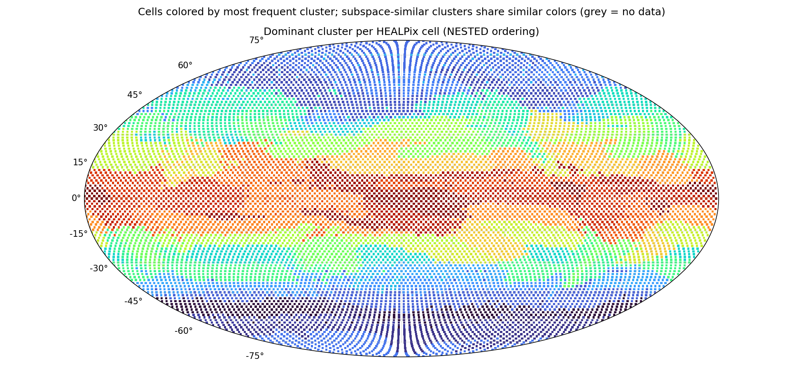

# Subspace clustering report — `subspace_out`

*Generated 2026-06-12 12:21 by `analyze_subspaces.py`. K=64 affine subspaces of dim 16 in 2048-dim token space, 18,432,000 tokens.*

## Configuration

| parameter | value |
|---|---|
| src | latents_2 |
| num_files | 1500 |
| tokens_per_file | 12288 |
| clusters | 64 |
| dim | 16 |
| iters | 25 |
| tol | 0.001 |
| linear | False |
| seed | 0 |
| chunk_size | 262144 |
| gpus | 2 |
| tokens analyzed | 18,432,000 |

## Token sample

- **Sample fingerprint:** `696d43894e89` — runs sharing this fingerprint were clustered on the identical token set and are directly comparable.
- **Files:** 1500 latent files, 12288 tokens each, seed 0.
- **Reproduce this exact sample** for a new run (e.g. to vary K or d):

  ```bash
  python3 subspace_kmeans.py --files-from subspace_out/sample.json --seed 0 --tokens-per-file 12288 \
      --clusters <K> --dim <d> --out <new_dir>
  ```
- File ids (first 20 of 1500, full list in `subspace_out/sample.json`): 21, 25, 50, 77, 100, 102, 106, 109, 114, 117, 122, 126, 130, 140, 142, 150, 156, 158, 160, 167 …

## Convergence

| iter | objective/token | labels changed | min size | max size |
|---|---|---|---|---|
| 1 | 8056.01 | 100.00% | 153 | 5,261,611 |
| 2 | 3867.60 | 65.48% | 6,139 | 1,529,903 |
| 3 | 3663.00 | 40.02% | 36,265 | 924,498 |
| 4 | 3589.31 | 23.34% | 78,771 | 989,734 |
| 5 | 3556.03 | 16.24% | 93,768 | 967,585 |
| 6 | 3537.25 | 12.59% | 102,951 | 913,302 |
| 7 | 3524.10 | 10.40% | 109,800 | 854,765 |
| 8 | 3513.86 | 8.73% | 114,951 | 802,072 |
| 9 | 3506.54 | 7.34% | 118,064 | 757,457 |
| 10 | 3501.60 | 6.16% | 119,088 | 725,064 |
| 11 | 3497.92 | 5.28% | 119,722 | 700,389 |
| 12 | 3495.07 | 4.60% | 120,554 | 681,003 |
| 13 | 3492.83 | 4.03% | 120,897 | 665,461 |
| 14 | 3491.10 | 3.58% | 121,062 | 652,968 |
| 15 | 3489.68 | 3.22% | 121,268 | 642,510 |
| 16 | 3488.52 | 2.93% | 121,531 | 633,881 |
| 17 | 3487.54 | 2.69% | 121,847 | 626,253 |
| 18 | 3486.70 | 2.49% | 122,414 | 619,300 |
| 19 | 3485.98 | 2.30% | 123,185 | 613,110 |
| 20 | 3485.34 | 2.14% | 123,901 | 607,460 |
| 21 | 3484.80 | 1.98% | 124,697 | 602,101 |
| 22 | 3484.33 | 1.84% | 125,243 | 597,422 |
| 23 | 3483.94 | 1.72% | 125,737 | 592,889 |
| 24 | 3483.58 | 1.61% | 126,322 | 588,483 |
| 25 | 3483.27 | 1.52% | 126,764 | 584,417 |

## Global variance decomposition

Total token variance E‖x−μ_global‖² = **5999**, split into:

- **8.5%** between clusters (the means alone — how much cluster identity explains)
- **33.5%** within clusters, captured by the top-16 subspace directions
- **58.1%** residual (unexplained by the model)

Count-weighted within-cluster EVR(top-16): **0.374**. Dimensions needed for 80% of captured variance: min 10 / median 11 / max 12 (close to 16 ⇒ flat spectrum, consider larger --dim).

## Clusters (sorted by size)

Spatial columns are over the 12288 HEALPix cells with data; `cells@50%` = number of cells holding half the cluster's tokens (low = localized); `owned` = cells where this cluster is the most common label; `files` = share of the 1500 sampled time steps where the cluster appears; `tCV` = coefficient of variation of its share across time deciles (0 = constant in time).

| cluster | tokens | share | EVR(top-16) | d80 | cells@50% | owned | files | tCV |
|---|---|---|---|---|---|---|---|---|
| 45 | 584,417 | 3.2% | 0.415 | 10 | 304 | 595 | 100% | 0.10 |
| 63 | 470,382 | 2.6% | 0.458 | 10 | 638 | 363 | 100% | 0.01 |
| 21 | 451,865 | 2.5% | 0.386 | 10 | 632 | 129 | 100% | 0.08 |
| 6 | 449,124 | 2.4% | 0.447 | 11 | 178 | 361 | 100% | 0.09 |
| 32 | 430,777 | 2.3% | 0.410 | 10 | 502 | 515 | 100% | 0.03 |
| 25 | 428,682 | 2.3% | 0.413 | 10 | 501 | 378 | 100% | 0.07 |
| 59 | 402,332 | 2.2% | 0.436 | 10 | 498 | 275 | 100% | 0.03 |
| 0 | 397,508 | 2.2% | 0.441 | 10 | 133 | 266 | 100% | 0.01 |
| 14 | 394,686 | 2.1% | 0.432 | 10 | 590 | 222 | 100% | 0.09 |
| 53 | 370,627 | 2.0% | 0.359 | 11 | 394 | 245 | 100% | 0.09 |
| 28 | 369,699 | 2.0% | 0.488 | 10 | 422 | 185 | 100% | 0.12 |
| 36 | 363,697 | 2.0% | 0.458 | 10 | 719 | 40 | 100% | 0.03 |
| 42 | 360,709 | 2.0% | 0.364 | 11 | 564 | 357 | 100% | 0.06 |
| 54 | 345,673 | 1.9% | 0.458 | 10 | 500 | 143 | 100% | 0.03 |
| 57 | 343,451 | 1.9% | 0.394 | 11 | 433 | 259 | 100% | 0.04 |
| 26 | 343,357 | 1.9% | 0.373 | 11 | 375 | 327 | 100% | 0.09 |
| 10 | 343,079 | 1.9% | 0.397 | 11 | 720 | 199 | 100% | 0.08 |
| 39 | 337,447 | 1.8% | 0.334 | 12 | 186 | 235 | 100% | 0.07 |
| 31 | 334,066 | 1.8% | 0.393 | 11 | 605 | 262 | 100% | 0.03 |
| 56 | 331,721 | 1.8% | 0.381 | 11 | 719 | 74 | 100% | 0.05 |
| 50 | 310,330 | 1.7% | 0.329 | 12 | 162 | 243 | 100% | 0.10 |
| 22 | 296,399 | 1.6% | 0.400 | 10 | 579 | 189 | 100% | 0.03 |
| 52 | 296,298 | 1.6% | 0.341 | 11 | 130 | 269 | 100% | 0.05 |
| 5 | 288,995 | 1.6% | 0.319 | 12 | 575 | 147 | 100% | 0.08 |
| 19 | 284,986 | 1.5% | 0.361 | 11 | 410 | 293 | 100% | 0.04 |
| 44 | 284,571 | 1.5% | 0.337 | 12 | 353 | 200 | 100% | 0.06 |
| 40 | 282,583 | 1.5% | 0.407 | 10 | 674 | 63 | 100% | 0.04 |
| 18 | 280,628 | 1.5% | 0.339 | 11 | 155 | 263 | 100% | 0.06 |
| 47 | 279,483 | 1.5% | 0.332 | 12 | 511 | 135 | 100% | 0.09 |
| 15 | 278,233 | 1.5% | 0.330 | 12 | 470 | 159 | 100% | 0.12 |
| 58 | 272,910 | 1.5% | 0.332 | 12 | 290 | 270 | 100% | 0.09 |
| 23 | 266,842 | 1.4% | 0.352 | 12 | 323 | 195 | 100% | 0.11 |
| 35 | 266,476 | 1.4% | 0.325 | 12 | 304 | 253 | 100% | 0.06 |
| 62 | 266,305 | 1.4% | 0.335 | 12 | 173 | 249 | 100% | 0.14 |
| 24 | 265,301 | 1.4% | 0.367 | 11 | 380 | 102 | 99% | 0.14 |
| 7 | 263,725 | 1.4% | 0.347 | 12 | 480 | 62 | 100% | 0.11 |
| 17 | 262,072 | 1.4% | 0.328 | 12 | 501 | 91 | 100% | 0.04 |
| 41 | 257,959 | 1.4% | 0.325 | 12 | 333 | 220 | 100% | 0.08 |
| 12 | 256,461 | 1.4% | 0.342 | 12 | 360 | 181 | 100% | 0.06 |
| 43 | 255,453 | 1.4% | 0.322 | 12 | 274 | 188 | 100% | 0.11 |
| 61 | 251,433 | 1.4% | 0.361 | 11 | 188 | 228 | 100% | 0.10 |
| 8 | 248,605 | 1.3% | 0.294 | 12 | 172 | 219 | 100% | 0.08 |
| 30 | 247,270 | 1.3% | 0.354 | 11 | 129 | 289 | 100% | 0.06 |
| 4 | 245,235 | 1.3% | 0.362 | 11 | 208 | 202 | 100% | 0.07 |
| 11 | 244,152 | 1.3% | 0.320 | 12 | 537 | 103 | 100% | 0.04 |
| 13 | 236,495 | 1.3% | 0.361 | 11 | 499 | 125 | 100% | 0.08 |
| 2 | 233,132 | 1.3% | 0.396 | 11 | 673 | 52 | 100% | 0.10 |
| 60 | 219,217 | 1.2% | 0.313 | 12 | 187 | 167 | 100% | 0.02 |
| 38 | 218,717 | 1.2% | 0.339 | 12 | 194 | 206 | 100% | 0.14 |
| 34 | 216,743 | 1.2% | 0.304 | 12 | 333 | 86 | 100% | 0.10 |
| 16 | 215,797 | 1.2% | 0.339 | 12 | 379 | 104 | 100% | 0.13 |
| 46 | 214,159 | 1.2% | 0.352 | 11 | 438 | 63 | 100% | 0.08 |
| 48 | 208,742 | 1.1% | 0.350 | 12 | 153 | 175 | 100% | 0.06 |
| 37 | 207,942 | 1.1% | 0.319 | 12 | 355 | 34 | 100% | 0.07 |
| 1 | 207,897 | 1.1% | 0.330 | 12 | 290 | 80 | 100% | 0.12 |
| 55 | 205,599 | 1.1% | 0.310 | 12 | 134 | 162 | 100% | 0.04 |
| 51 | 203,764 | 1.1% | 0.351 | 11 | 244 | 151 | 97% | 0.13 |
| 20 | 203,453 | 1.1% | 0.341 | 11 | 210 | 225 | 99% | 0.18 |
| 33 | 200,349 | 1.1% | 0.398 | 10 | 628 | 2 | 100% | 0.03 |
| 9 | 196,636 | 1.1% | 0.360 | 11 | 325 | 104 | 100% | 0.13 |
| 29 | 192,338 | 1.0% | 0.318 | 12 | 187 | 138 | 100% | 0.15 |
| 3 | 163,374 | 0.9% | 0.361 | 11 | 905 | 0 | 100% | 0.03 |
| 49 | 154,878 | 0.8% | 0.378 | 11 | 52 | 104 | 100% | 0.01 |
| 27 | 126,764 | 0.7% | 0.357 | 11 | 125 | 67 | 87% | 0.17 |

## Subspace affinity between clusters

Affinity(i,j) = ‖Uᵢᵀ·Uⱼ‖²_F / 16 ∈ [0,1]: mean squared cosine of the principal angles between the two subspaces (1 = identical span, 0 = orthogonal). High-affinity pairs are candidates for merging (K may be too large); uniformly low values mean genuinely distinct regimes.

Off-diagonal affinity: median 0.325, mean 0.341, max 0.671.

| pair | subspace affinity | mean-vector cosine |
|---|---|---|
| 14 ↔ 25 | 0.671 | 0.269 |
| 26 ↔ 31 | 0.663 | 0.571 |
| 6 ↔ 28 | 0.654 | 0.522 |
| 5 ↔ 47 | 0.652 | 0.757 |
| 36 ↔ 63 | 0.651 | 0.261 |
| 4 ↔ 30 | 0.647 | 0.448 |
| 37 ↔ 41 | 0.643 | 0.891 |
| 13 ↔ 46 | 0.638 | 0.444 |
| 14 ↔ 59 | 0.636 | -0.023 |
| 5 ↔ 11 | 0.634 | 0.660 |
| 25 ↔ 45 | 0.633 | 0.238 |
| 36 ↔ 54 | 0.626 | 0.528 |

## Most time-varying clusters

Enrichment of each cluster per time decile of the dataset (file index 0…13020; 1.00 = the cluster's average rate). Values ≫1 mark the periods where the cluster concentrates — a strong seasonal/temporal signature.

| cluster | tCV | D0 | D1 | D2 | D3 | D4 | D5 | D6 | D7 | D8 | D9 |
|---|---|---|---|---|---|---|---|---|---|---|---|
| 20 | 0.18 | 1.04 | 0.97 | 0.86 | 0.65 | 0.82 | 0.98 | 1.07 | 1.23 | 1.07 | 1.23 |
| 27 | 0.17 | 1.07 | 0.98 | 0.85 | 0.76 | 0.77 | 0.98 | 1.00 | 1.19 | 1.13 | 1.27 |
| 29 | 0.15 | 0.98 | 1.09 | 1.05 | 1.29 | 1.04 | 1.18 | 0.96 | 0.87 | 0.83 | 0.80 |
| 62 | 0.14 | 0.94 | 0.82 | 0.91 | 0.84 | 1.01 | 0.91 | 1.07 | 1.29 | 1.03 | 1.14 |
| 38 | 0.14 | 1.05 | 1.19 | 0.86 | 0.81 | 0.81 | 0.95 | 1.08 | 0.95 | 1.11 | 1.11 |
| 24 | 0.14 | 0.94 | 0.99 | 1.11 | 1.21 | 1.04 | 1.17 | 1.01 | 0.87 | 0.77 | 0.94 |
| 51 | 0.13 | 0.97 | 0.99 | 1.11 | 1.16 | 1.03 | 1.16 | 1.09 | 0.88 | 0.74 | 0.92 |
| 16 | 0.13 | 0.98 | 0.94 | 0.74 | 0.87 | 1.08 | 0.98 | 1.05 | 1.07 | 1.10 | 1.20 |

## World map



Each of the 12,288 HEALPix cells is colored by its most frequent cluster (grey = no data). Cell indices use **NESTED HEALPix ordering** (confirmed: geographically coherent continent-scale regions appear under NESTED, incoherent stripes under RING). Colors are assigned by spectral ordering of the subspace-affinity matrix, so subspace-similar clusters share similar hues — real regions read as smooth gradients, genuine noise stays speckled.

## Interpretation notes

- *Localized + present in ~100% of files* (low `cells@50%`, `files` ≈ 100%) ⇒ the cluster is a **geographic regime** (region/surface type), stable in time.
- *High `tCV` with smooth decile profile* ⇒ **seasonal or trend** behaviour; check the decile table above.
- *EVR near the global average with d80 ≈ d* ⇒ the subspace dimension truncates the spectrum; re-run with larger `--dim` to capture more structure.
- Subspace bases live in `model.pt['U']` `[K, 2048, d]` (orthonormal columns, descending eigenvalue order); project tokens with `(x-μ_j) @ U_j`.
