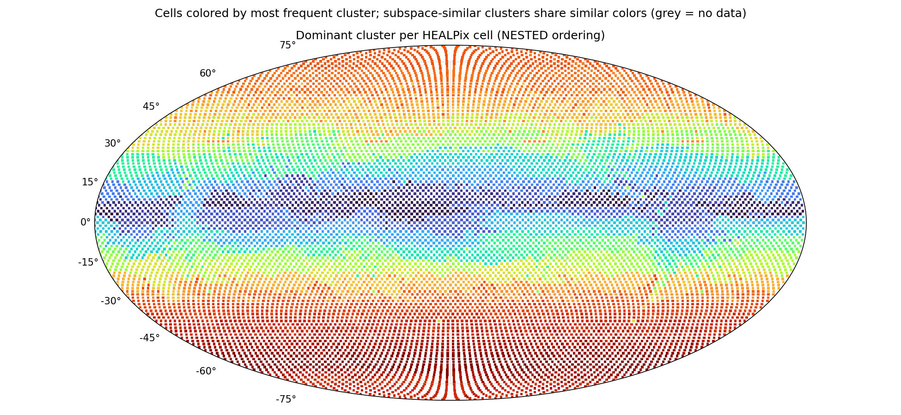

# Subspace clustering report — `subspace_big_d128`

*Generated 2026-06-18 16:51 by `analyze_subspaces.py`. K=128 affine subspaces of dim 128 in 2048-dim token space, 86,016,000 tokens.*

## Configuration

| parameter | value |
|---|---|
| src | latents_2 |
| num_files | 7000 |
| tokens_per_file | 12288 |
| clusters | 128 |
| dim | 128 |
| iters | 25 |
| tol | 0.001 |
| linear | False |
| seed | 0 |
| chunk_size | 65536 |
| gpus | 2 |
| tokens analyzed | 86,016,000 |

## Token sample

- **Sample fingerprint:** `82ca602ed7e7` — runs sharing this fingerprint were clustered on the identical token set and are directly comparable.
- **Files:** 7000 latent files, 12288 tokens each, seed 0.
- **Reproduce this exact sample** for a new run (e.g. to vary K or d):

  ```bash
  python3 subspace_kmeans.py --files-from subspace_big_d128/sample.json --seed 0 --tokens-per-file 12288 \
      --clusters <K> --dim <d> --out <new_dir>
  ```
- File ids (first 20 of 7000, full list in `subspace_big_d128/sample.json`): 0, 1, 6, 8, 9, 10, 11, 12, 13, 14, 16, 18, 19, 21, 22, 24, 25, 26, 27, 28 …

## Convergence

| iter | objective/token | labels changed | min size | max size |
|---|---|---|---|---|
| 1 | 7659.20 | 100.00% | 127 | 23,702,502 |
| 2 | 1537.71 | 82.05% | 1 | 3,046,976 |
| 3 | 1254.74 | 39.89% | 1 | 1,956,018 |
| 4 | 1183.18 | 21.74% | 1 | 1,847,308 |
| 5 | 1148.56 | 14.95% | 1 | 1,802,821 |
| 6 | 1126.78 | 10.79% | 1 | 1,782,011 |
| 7 | 1112.20 | 8.17% | 1 | 1,761,839 |
| 8 | 1101.79 | 6.25% | 1 | 1,736,340 |
| 9 | 1094.42 | 4.85% | 1 | 1,709,658 |
| 10 | 1088.87 | 3.89% | 1 | 1,695,932 |
| 11 | 1084.82 | 3.20% | 1 | 1,686,683 |
| 12 | 1081.58 | 2.69% | 1 | 1,671,045 |
| 13 | 1079.01 | 2.27% | 1 | 1,660,471 |
| 14 | 1076.99 | 1.95% | 1 | 1,650,157 |
| 15 | 1075.33 | 1.72% | 1 | 1,636,778 |
| 16 | 1073.82 | 1.52% | 1 | 1,628,287 |
| 17 | 1072.43 | 1.33% | 1 | 1,614,236 |
| 18 | 1071.37 | 1.13% | 1 | 1,594,367 |
| 19 | 1070.59 | 0.97% | 1 | 1,585,536 |
| 20 | 1070.00 | 0.88% | 1 | 1,581,365 |
| 21 | 1069.43 | 0.80% | 1 | 1,580,816 |
| 22 | 1068.93 | 0.72% | 1 | 1,579,721 |
| 23 | 1068.55 | 0.65% | 1 | 1,575,612 |
| 24 | 1068.22 | 0.60% | 1 | 1,574,534 |
| 25 | 1067.90 | 0.56% | 1 | 1,574,526 |

## Global variance decomposition

Total token variance E‖x−μ_global‖² = **5998**, split into:

- **6.2%** between clusters (the means alone — how much cluster identity explains)
- **76.0%** within clusters, captured by the top-128 subspace directions
- **17.8%** residual (unexplained by the model)

Count-weighted within-cluster EVR(top-128): **0.816**. Dimensions needed for 80% of captured variance: min 47 / median 63 / max 129 (close to 128 ⇒ flat spectrum, consider larger --dim).

## Clusters (sorted by size)

Spatial columns are over the 12288 HEALPix cells with data; `cells@50%` = number of cells holding half the cluster's tokens (low = localized); `owned` = cells where this cluster is the most common label; `files` = share of the 7000 sampled time steps where the cluster appears; `tCV` = coefficient of variation of its share across time deciles (0 = constant in time).

| cluster | tokens | share | EVR(top-128) | d80 | cells@50% | owned | files | tCV |
|---|---|---|---|---|---|---|---|---|
| 66 | 1,574,526 | 1.8% | 0.845 | 53 | 113 | 225 | 100% | 0.00 |
| 114 | 1,365,618 | 1.6% | 0.789 | 66 | 99 | 217 | 100% | 0.02 |
| 27 | 1,343,642 | 1.6% | 0.843 | 55 | 96 | 192 | 100% | 0.00 |
| 59 | 1,271,399 | 1.5% | 0.831 | 60 | 97 | 207 | 100% | 0.01 |
| 127 | 1,175,809 | 1.4% | 0.862 | 52 | 84 | 168 | 100% | 0.00 |
| 74 | 1,103,359 | 1.3% | 0.838 | 56 | 79 | 158 | 100% | 0.00 |
| 39 | 1,083,907 | 1.3% | 0.846 | 57 | 78 | 158 | 100% | 0.00 |
| 70 | 1,014,693 | 1.2% | 0.843 | 55 | 73 | 148 | 100% | 0.00 |
| 56 | 1,007,427 | 1.2% | 0.845 | 55 | 72 | 144 | 100% | 0.00 |
| 35 | 1,006,905 | 1.2% | 0.850 | 57 | 72 | 144 | 100% | 0.00 |
| 117 | 1,000,516 | 1.2% | 0.813 | 63 | 74 | 154 | 100% | 0.01 |
| 50 | 994,073 | 1.2% | 0.877 | 47 | 72 | 142 | 100% | 0.00 |
| 31 | 988,045 | 1.1% | 0.770 | 66 | 112 | 102 | 100% | 0.06 |
| 82 | 986,238 | 1.1% | 0.788 | 64 | 89 | 177 | 100% | 0.06 |
| 78 | 980,030 | 1.1% | 0.869 | 49 | 71 | 140 | 100% | 0.00 |
| 42 | 961,181 | 1.1% | 0.800 | 60 | 76 | 146 | 100% | 0.05 |
| 21 | 952,025 | 1.1% | 0.866 | 62 | 69 | 136 | 100% | 0.00 |
| 86 | 934,307 | 1.1% | 0.799 | 64 | 69 | 157 | 100% | 0.01 |
| 83 | 922,805 | 1.1% | 0.864 | 52 | 66 | 132 | 100% | 0.00 |
| 0 | 916,815 | 1.1% | 0.858 | 51 | 66 | 131 | 100% | 0.00 |
| 14 | 909,963 | 1.1% | 0.861 | 53 | 65 | 130 | 100% | 0.00 |
| 93 | 896,151 | 1.0% | 0.883 | 49 | 65 | 128 | 100% | 0.00 |
| 107 | 894,539 | 1.0% | 0.875 | 56 | 64 | 128 | 100% | 0.00 |
| 125 | 894,157 | 1.0% | 0.836 | 56 | 64 | 128 | 100% | 0.00 |
| 68 | 889,356 | 1.0% | 0.881 | 48 | 64 | 127 | 100% | 0.00 |
| 61 | 888,123 | 1.0% | 0.795 | 63 | 64 | 128 | 100% | 0.01 |
| 73 | 885,567 | 1.0% | 0.770 | 68 | 156 | 58 | 98% | 0.09 |
| 18 | 880,798 | 1.0% | 0.806 | 56 | 96 | 159 | 100% | 0.05 |
| 110 | 857,207 | 1.0% | 0.815 | 64 | 62 | 133 | 100% | 0.01 |
| 48 | 846,496 | 1.0% | 0.775 | 67 | 79 | 127 | 100% | 0.13 |
| 1 | 846,093 | 1.0% | 0.765 | 67 | 70 | 122 | 100% | 0.11 |
| 33 | 835,300 | 1.0% | 0.810 | 62 | 65 | 140 | 100% | 0.01 |
| 25 | 832,368 | 1.0% | 0.834 | 58 | 60 | 119 | 100% | 0.00 |
| 6 | 827,268 | 1.0% | 0.818 | 63 | 63 | 132 | 100% | 0.01 |
| 4 | 827,126 | 1.0% | 0.825 | 61 | 65 | 136 | 100% | 0.01 |
| 85 | 826,362 | 1.0% | 0.790 | 66 | 60 | 109 | 100% | 0.03 |
| 95 | 821,434 | 1.0% | 0.817 | 59 | 67 | 152 | 100% | 0.05 |
| 52 | 806,289 | 0.9% | 0.793 | 58 | 125 | 84 | 97% | 0.14 |
| 46 | 802,565 | 0.9% | 0.802 | 65 | 58 | 124 | 100% | 0.03 |
| 90 | 795,516 | 0.9% | 0.827 | 59 | 57 | 116 | 100% | 0.00 |
| 94 | 794,584 | 0.9% | 0.847 | 57 | 57 | 115 | 100% | 0.00 |
| 43 | 785,081 | 0.9% | 0.817 | 50 | 151 | 34 | 96% | 0.13 |
| 60 | 780,128 | 0.9% | 0.793 | 65 | 60 | 126 | 100% | 0.05 |
| 89 | 777,649 | 0.9% | 0.805 | 62 | 56 | 111 | 100% | 0.00 |
| 80 | 777,408 | 0.9% | 0.850 | 56 | 56 | 110 | 100% | 0.00 |
| 16 | 765,719 | 0.9% | 0.816 | 61 | 55 | 111 | 100% | 0.01 |
| 124 | 762,844 | 0.9% | 0.829 | 62 | 56 | 117 | 100% | 0.01 |
| 115 | 754,420 | 0.9% | 0.794 | 64 | 56 | 115 | 100% | 0.02 |
| 5 | 742,078 | 0.9% | 0.800 | 64 | 55 | 115 | 100% | 0.03 |
| 71 | 739,486 | 0.9% | 0.783 | 64 | 76 | 105 | 100% | 0.08 |
| 126 | 735,090 | 0.9% | 0.786 | 63 | 60 | 123 | 100% | 0.18 |
| 26 | 729,791 | 0.8% | 0.767 | 68 | 112 | 90 | 100% | 0.11 |
| 123 | 728,131 | 0.8% | 0.881 | 48 | 53 | 104 | 100% | 0.00 |
| 76 | 722,591 | 0.8% | 0.826 | 58 | 52 | 106 | 100% | 0.01 |
| 40 | 719,166 | 0.8% | 0.776 | 67 | 84 | 136 | 100% | 0.09 |
| 15 | 709,928 | 0.8% | 0.768 | 69 | 51 | 106 | 100% | 0.00 |
| 58 | 706,870 | 0.8% | 0.789 | 65 | 55 | 119 | 100% | 0.02 |
| 54 | 697,371 | 0.8% | 0.769 | 66 | 185 | 34 | 100% | 0.07 |
| 19 | 697,353 | 0.8% | 0.806 | 64 | 52 | 113 | 100% | 0.02 |
| 96 | 693,214 | 0.8% | 0.821 | 63 | 51 | 107 | 100% | 0.01 |
| 69 | 692,651 | 0.8% | 0.809 | 64 | 53 | 112 | 100% | 0.01 |
| 119 | 679,130 | 0.8% | 0.865 | 52 | 49 | 97 | 100% | 0.00 |
| 121 | 662,092 | 0.8% | 0.835 | 57 | 48 | 98 | 100% | 0.01 |
| 84 | 649,226 | 0.8% | 0.772 | 66 | 62 | 97 | 100% | 0.15 |
| 22 | 646,002 | 0.8% | 0.775 | 67 | 73 | 83 | 100% | 0.12 |
| 17 | 637,385 | 0.7% | 0.880 | 47 | 46 | 91 | 100% | 0.00 |
| 105 | 636,797 | 0.7% | 0.762 | 69 | 48 | 90 | 100% | 0.05 |
| 81 | 631,723 | 0.7% | 0.811 | 63 | 46 | 92 | 100% | 0.01 |
| 36 | 630,825 | 0.7% | 0.775 | 62 | 189 | 5 | 100% | 0.06 |
| 98 | 613,360 | 0.7% | 0.811 | 51 | 268 | 0 | 100% | 0.05 |
| 97 | 608,638 | 0.7% | 0.787 | 67 | 53 | 105 | 100% | 0.06 |
| 51 | 605,314 | 0.7% | 0.796 | 65 | 44 | 93 | 100% | 0.02 |
| 53 | 600,865 | 0.7% | 0.778 | 65 | 50 | 86 | 100% | 0.06 |
| 120 | 594,010 | 0.7% | 0.798 | 63 | 44 | 91 | 100% | 0.03 |
| 104 | 590,766 | 0.7% | 0.781 | 65 | 72 | 78 | 100% | 0.17 |
| 23 | 587,598 | 0.7% | 0.771 | 68 | 43 | 85 | 100% | 0.00 |
| 122 | 581,011 | 0.7% | 0.784 | 60 | 126 | 8 | 100% | 0.11 |
| 55 | 569,578 | 0.7% | 0.846 | 57 | 42 | 84 | 100% | 0.00 |
| 62 | 567,793 | 0.7% | 0.809 | 64 | 42 | 84 | 100% | 0.01 |
| 118 | 564,627 | 0.7% | 0.772 | 69 | 41 | 81 | 100% | 0.01 |
| 3 | 563,759 | 0.7% | 0.805 | 65 | 41 | 80 | 100% | 0.03 |
| 10 | 563,345 | 0.7% | 0.853 | 52 | 41 | 80 | 100% | 0.00 |
| 45 | 551,565 | 0.6% | 0.784 | 67 | 64 | 104 | 100% | 0.06 |
| 101 | 551,429 | 0.6% | 0.781 | 65 | 50 | 98 | 100% | 0.08 |
| 75 | 549,794 | 0.6% | 0.798 | 68 | 40 | 90 | 100% | 0.02 |
| 111 | 547,956 | 0.6% | 0.874 | 50 | 40 | 78 | 100% | 0.00 |
| 57 | 542,378 | 0.6% | 0.802 | 66 | 42 | 96 | 100% | 0.04 |
| 77 | 531,817 | 0.6% | 0.887 | 48 | 38 | 76 | 100% | 0.00 |
| 7 | 525,432 | 0.6% | 0.762 | 70 | 48 | 73 | 100% | 0.09 |
| 24 | 519,492 | 0.6% | 0.777 | 65 | 85 | 54 | 97% | 0.14 |
| 30 | 518,387 | 0.6% | 0.800 | 65 | 39 | 75 | 100% | 0.06 |
| 113 | 513,800 | 0.6% | 0.844 | 53 | 38 | 73 | 100% | 0.01 |
| 11 | 513,319 | 0.6% | 0.808 | 61 | 38 | 68 | 100% | 0.03 |
| 47 | 510,144 | 0.6% | 0.800 | 64 | 37 | 79 | 100% | 0.03 |
| 37 | 508,849 | 0.6% | 0.795 | 68 | 38 | 78 | 100% | 0.01 |
| 41 | 487,240 | 0.6% | 0.840 | 59 | 36 | 73 | 100% | 0.00 |
| 79 | 486,394 | 0.6% | 0.800 | 67 | 35 | 79 | 100% | 0.03 |
| 9 | 484,866 | 0.6% | 0.791 | 67 | 38 | 83 | 100% | 0.04 |
| 112 | 478,073 | 0.6% | 0.805 | 69 | 35 | 75 | 100% | 0.02 |
| 99 | 477,003 | 0.6% | 0.811 | 65 | 35 | 73 | 100% | 0.01 |
| 67 | 474,430 | 0.6% | 0.802 | 67 | 35 | 79 | 100% | 0.02 |
| 44 | 461,596 | 0.5% | 0.803 | 65 | 34 | 70 | 100% | 0.02 |
| 108 | 457,743 | 0.5% | 0.800 | 64 | 40 | 83 | 100% | 0.08 |
| 87 | 452,132 | 0.5% | 0.820 | 62 | 33 | 65 | 100% | 0.01 |
| 88 | 447,984 | 0.5% | 0.821 | 61 | 33 | 67 | 100% | 0.01 |
| 34 | 442,614 | 0.5% | 0.830 | 59 | 32 | 64 | 100% | 0.00 |
| 20 | 429,480 | 0.5% | 0.823 | 62 | 31 | 63 | 100% | 0.01 |
| 106 | 426,988 | 0.5% | 0.800 | 66 | 32 | 70 | 100% | 0.01 |
| 100 | 419,376 | 0.5% | 0.782 | 68 | 31 | 65 | 100% | 0.03 |
| 72 | 415,513 | 0.5% | 0.787 | 68 | 30 | 57 | 100% | 0.01 |
| 38 | 415,143 | 0.5% | 0.804 | 67 | 31 | 65 | 100% | 0.03 |
| 29 | 413,423 | 0.5% | 0.792 | 66 | 46 | 84 | 95% | 0.09 |
| 103 | 411,923 | 0.5% | 0.777 | 67 | 48 | 52 | 100% | 0.13 |
| 64 | 405,477 | 0.5% | 0.770 | 67 | 60 | 26 | 96% | 0.17 |
| 91 | 388,275 | 0.5% | 0.811 | 64 | 29 | 59 | 100% | 0.02 |
| 102 | 376,716 | 0.4% | 0.785 | 64 | 39 | 54 | 100% | 0.07 |
| 13 | 365,026 | 0.4% | 0.779 | 67 | 34 | 37 | 100% | 0.09 |
| 63 | 334,290 | 0.4% | 0.820 | 61 | 24 | 48 | 100% | 0.00 |
| 32 | 325,048 | 0.4% | 0.824 | 63 | 24 | 46 | 100% | 0.00 |
| 109 | 311,353 | 0.4% | 0.810 | 64 | 23 | 37 | 100% | 0.03 |
| 2 | 307,961 | 0.4% | 0.820 | 64 | 22 | 44 | 100% | 0.00 |
| 49 | 280,020 | 0.3% | 0.872 | 56 | 21 | 40 | 100% | 0.00 |
| 116 | 274,973 | 0.3% | 0.804 | 62 | 48 | 6 | 80% | 0.16 |
| 12 | 266,955 | 0.3% | 0.814 | 65 | 20 | 40 | 100% | 0.05 |
| 28 | 238,103 | 0.3% | 0.872 | 56 | 18 | 34 | 100% | 0.00 |
| 92 | 234,123 | 0.3% | 0.812 | 66 | 17 | 33 | 100% | 0.00 |
| 8 | 1 | 0.0% | 0.000 | 129 | 1 | 0 | 0% | 3.16 |
| 65 | 1 | 0.0% | 0.000 | 129 | 1 | 0 | 0% | 3.16 |

## Subspace affinity between clusters

Affinity(i,j) = ‖Uᵢᵀ·Uⱼ‖²_F / 128 ∈ [0,1]: mean squared cosine of the principal angles between the two subspaces (1 = identical span, 0 = orthogonal). High-affinity pairs are candidates for merging (K may be too large); uniformly low values mean genuinely distinct regimes.

Off-diagonal affinity: median 0.483, mean 0.482, max 0.829.

| pair | subspace affinity | mean-vector cosine |
|---|---|---|
| 31 ↔ 48 | 0.829 | 0.756 |
| 5 ↔ 60 | 0.826 | 0.676 |
| 58 ↔ 86 | 0.824 | 0.698 |
| 45 ↔ 101 | 0.824 | 0.731 |
| 9 ↔ 101 | 0.817 | 0.770 |
| 58 ↔ 82 | 0.817 | 0.656 |
| 9 ↔ 45 | 0.816 | 0.696 |
| 40 ↔ 45 | 0.815 | 0.606 |
| 46 ↔ 114 | 0.808 | 0.703 |
| 37 ↔ 58 | 0.804 | 0.825 |
| 22 ↔ 48 | 0.802 | 0.770 |
| 30 ↔ 85 | 0.802 | 0.787 |

## Most time-varying clusters

Enrichment of each cluster per time decile of the dataset (file index 0…13020; 1.00 = the cluster's average rate). Values ≫1 mark the periods where the cluster concentrates — a strong seasonal/temporal signature.

| cluster | tCV | D0 | D1 | D2 | D3 | D4 | D5 | D6 | D7 | D8 | D9 |
|---|---|---|---|---|---|---|---|---|---|---|---|
| 65 | 3.16 | 0.00 | 0.00 | 0.00 | 0.00 | 0.00 | 0.00 | 0.00 | 0.00 | 10.13 | 0.00 |
| 8 | 3.16 | 0.00 | 0.00 | 0.00 | 0.00 | 0.00 | 0.00 | 0.00 | 0.00 | 10.13 | 0.00 |
| 126 | 0.18 | 0.94 | 0.75 | 0.72 | 1.03 | 1.15 | 0.88 | 0.99 | 1.17 | 1.12 | 1.23 |
| 64 | 0.17 | 0.98 | 1.04 | 1.07 | 1.30 | 1.12 | 1.09 | 0.98 | 0.88 | 0.71 | 0.80 |
| 104 | 0.17 | 0.97 | 0.77 | 0.81 | 0.88 | 0.97 | 0.93 | 1.06 | 1.26 | 1.14 | 1.23 |
| 116 | 0.16 | 1.06 | 1.04 | 0.86 | 0.77 | 0.76 | 0.93 | 1.06 | 1.08 | 1.21 | 1.19 |
| 84 | 0.15 | 0.92 | 0.80 | 0.87 | 1.15 | 1.11 | 0.88 | 0.88 | 1.16 | 1.10 | 1.17 |
| 24 | 0.14 | 1.05 | 1.07 | 0.86 | 0.82 | 0.84 | 0.90 | 1.08 | 1.09 | 1.18 | 1.15 |

## World map



Each of the 12,288 HEALPix cells is colored by its most frequent cluster (grey = no data). Cell indices use **NESTED HEALPix ordering** (confirmed: geographically coherent continent-scale regions appear under NESTED, incoherent stripes under RING). Colors are assigned by spectral ordering of the subspace-affinity matrix, so subspace-similar clusters share similar hues — real regions read as smooth gradients, genuine noise stays speckled.

## Interpretation notes

- *Localized + present in ~100% of files* (low `cells@50%`, `files` ≈ 100%) ⇒ the cluster is a **geographic regime** (region/surface type), stable in time.
- *High `tCV` with smooth decile profile* ⇒ **seasonal or trend** behaviour; check the decile table above.
- *EVR near the global average with d80 ≈ d* ⇒ the subspace dimension truncates the spectrum; re-run with larger `--dim` to capture more structure.
- Subspace bases live in `model.pt['U']` `[K, 2048, d]` (orthonormal columns, descending eigenvalue order); project tokens with `(x-μ_j) @ U_j`.
