# Temporal & spatial report — `subspace_kmeans_runs/v7_seed1_d64`

*Generated 2026-06-26 00:11 by `temporal_spatial.py`. K=128 affine subspaces (d=64), 86,016,000 tokens from 7000 files. Maps reuse this run's existing assignments (no recomputation).*

## Time axis

The latents are ERA5 atmospheric states at **6-hourly cadence** (00/06/12/18 UTC — 4 per day). Each file stores only an integer sample index (`idx`), **not a timestamp**, so the calendar date is reconstructed positionally:

> `datetime = 2014-01-01 00:00 UTC + idx × 6 h`

The 13,021 files therefore span **file 0 = 2014-01-01 00:00** through **file 13020 = 2022-11-30 00:00**. (A complete 9-year 2014→2022 ERA5 record would run to 2022-12-31 18:00 — about 127 more steps — so the last ~month of 2022 is treated as not fully covered.) Monthly grouping below uses this reconstructed date.

Sampled files per calendar month: Jan 623, Feb 542, Mar 594, Apr 590, May 589, Jun 568, Jul 621, Aug 590, Sep 595, Oct 584, Nov 576, Dec 528.

## Annual map

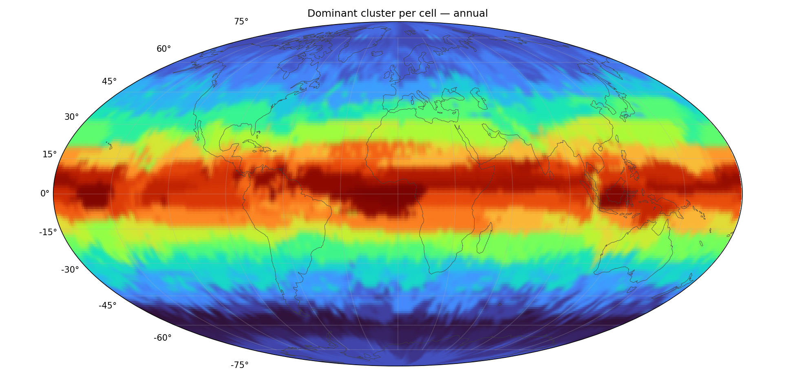

Dominant cluster per HEALPix cell across the full sample (NESTED ordering; grey = no data). Continent outlines are Natural Earth 110m; the field is the per-cell RGB (from spectral-ordered cluster colors) interpolated to a smooth heatmap. **Subspace-similar clusters share hues**, so coherent regions read as gradients.

## How the colors work

Cluster colors are **not random** — they are assigned so similar clusters get similar colors, which is what makes the maps readable (and the heatmap interpolation legitimate). The pipeline (`worldmap.py`):

1. **Affinity matrix (K×K)** — for each cluster pair, how similar they are. With subspaces (d>0) it is the mean squared cosine of the principal angles between the two bases, `‖UᵢᵀUⱼ‖²_F / d ∈ [0,1]` (1 = same subspace, 0 = orthogonal); for point clusters (d=0) the cosine of the two centroids. High affinity ⇒ nearby / overlapping structure.
2. **Spectral seriation** — take the *Fiedler vector* (the 2nd-smallest eigenvector of the normalized graph Laplacian of that affinity matrix): the classic 1-D embedding that places similar items next to each other. Ranking clusters by their Fiedler coordinate gives a single similarity-ordered sequence.
3. **Colormap** — that rank (0…K−1) is mapped through the smooth perceptual `turbo` colormap, so the order of colors along the rainbow exactly follows the similarity order: neighboring hues = affinity-similar clusters.
4. **Heatmap** — each cell takes its dominant cluster's RGB, and it is the **RGB** (not the integer cluster id) that is interpolated across the map. Interpolating a categorical id would be meaningless, but because step 3 already gave similar clusters similar RGB, blending two neighbors yields a sensible in-between color.

Reading the maps:
- Genuine structure shows up as **smooth gradients** (a region slowly shading into a neighboring hue); only true salt-and-pepper noise stays speckled. A *random* hue assignment would put a sharp color jump at every boundary and alias fine sub-regions as spurious "scatter," especially at large K.
- The **absolute hue is arbitrary** — blue vs red just reflects a cluster's position in the Fiedler order, which has no physical meaning; only the *transitions* and *groupings* carry information. So two months can look similarly hued where the same cluster family dominates, even if the exact dominant cluster differs.

## Monthly maps

One dominant-cluster map per calendar month (same color scale as the annual map), revealing the seasonal cycle. Each cell is colored by its most frequent cluster among that month's tokens.

**January** (623 files, 7,655,424 tokens)

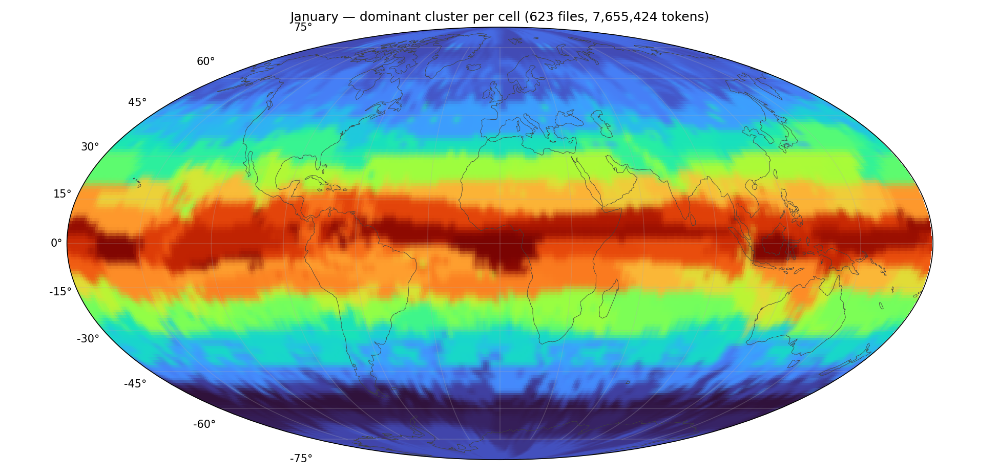

**February** (542 files, 6,660,096 tokens)

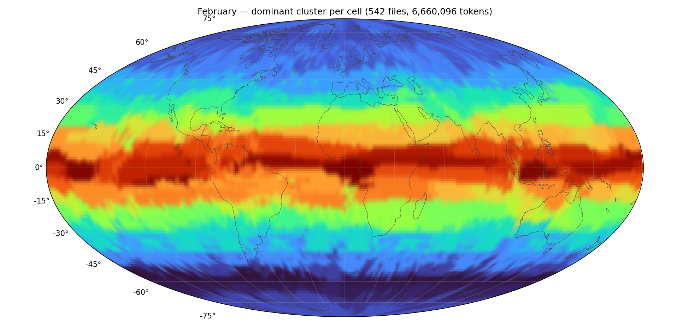

**March** (594 files, 7,299,072 tokens)

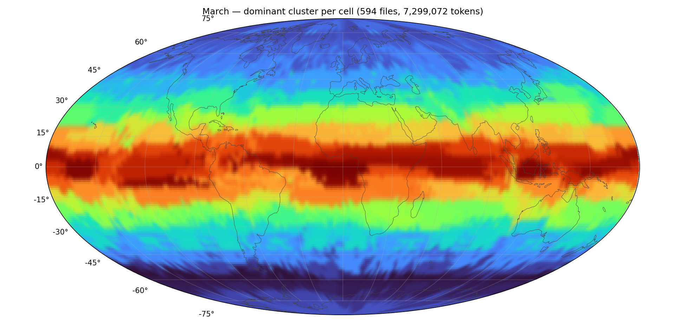

**April** (590 files, 7,249,920 tokens)

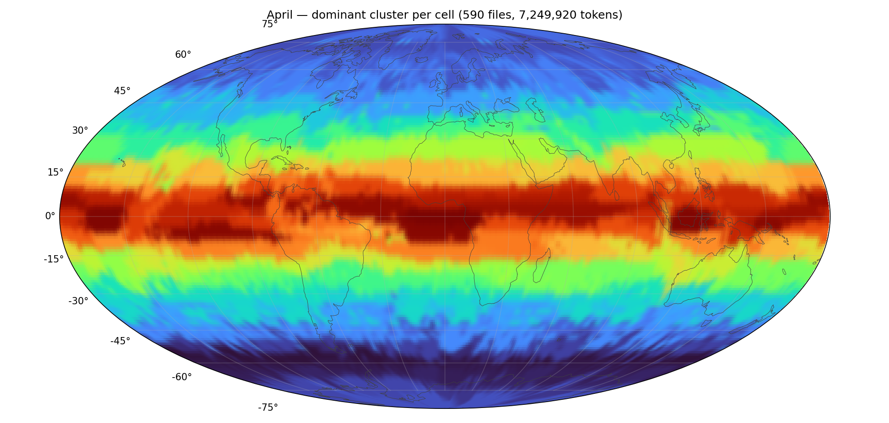

**May** (589 files, 7,237,632 tokens)

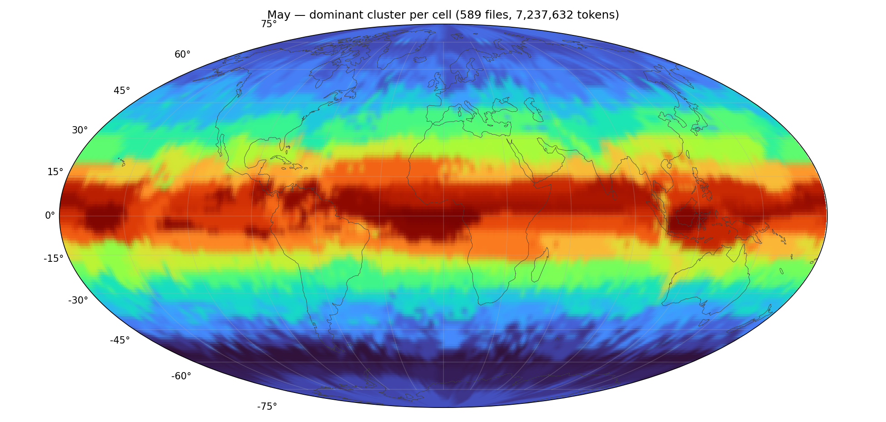

**June** (568 files, 6,979,584 tokens)

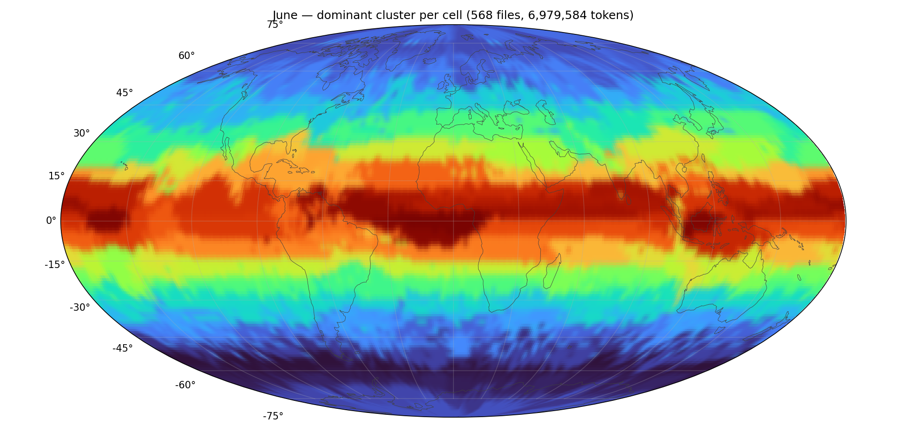

**July** (621 files, 7,630,848 tokens)

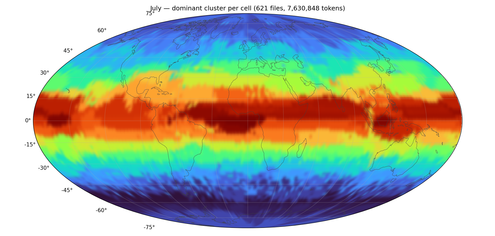

**August** (590 files, 7,249,920 tokens)

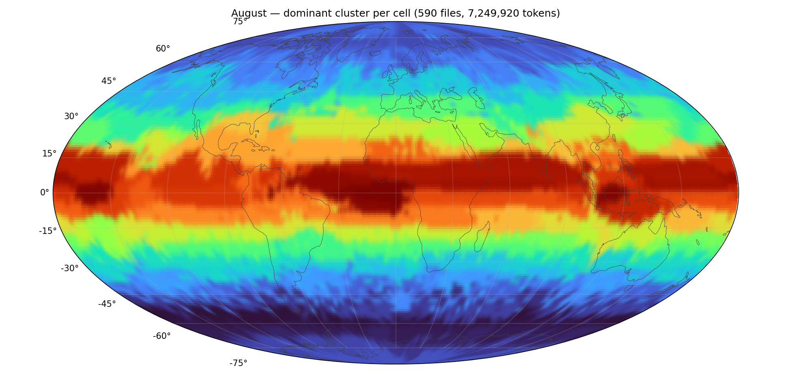

**September** (595 files, 7,311,360 tokens)

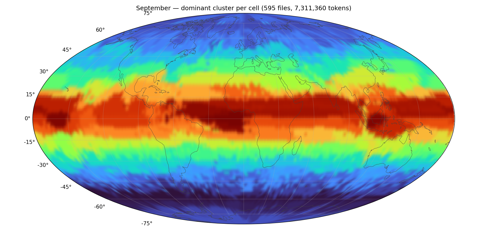

**October** (584 files, 7,176,192 tokens)

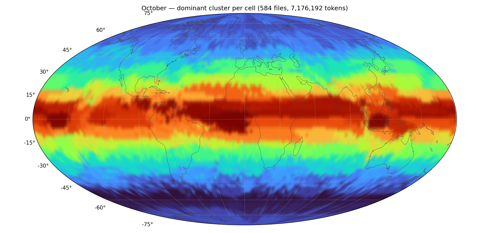

**November** (576 files, 7,077,888 tokens)

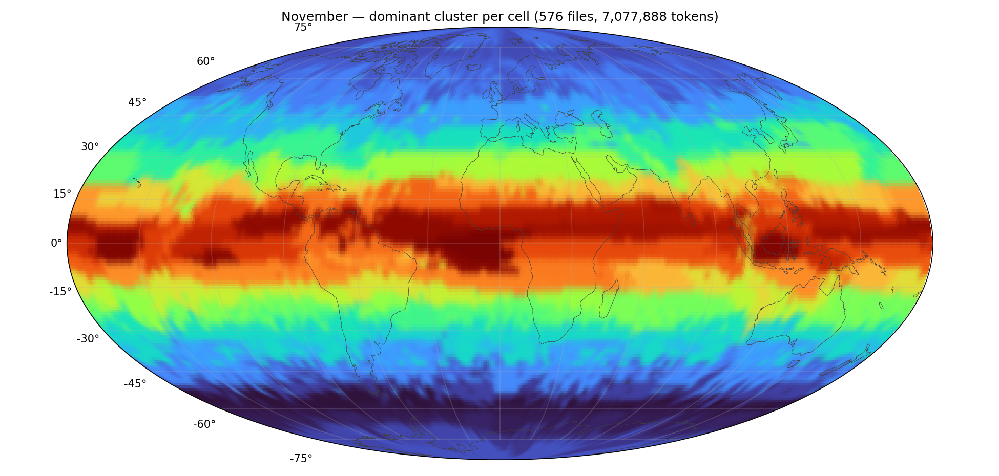

**December** (528 files, 6,488,064 tokens)

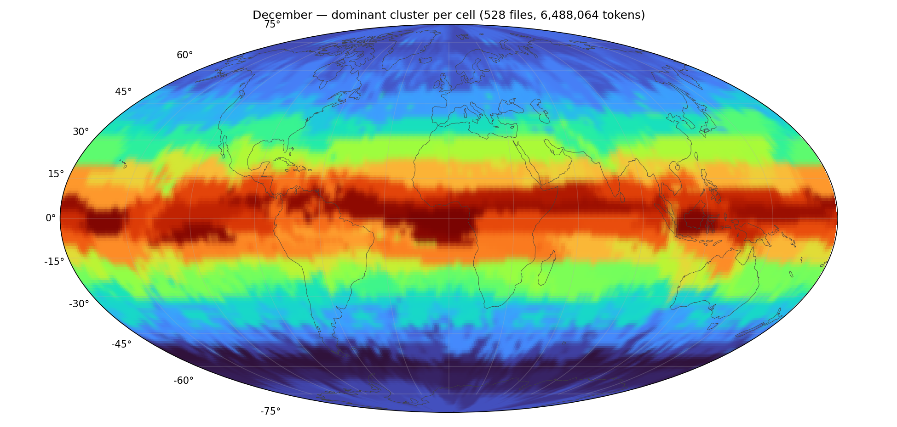

## Most seasonal clusters

Enrichment of each cluster per month = `(cluster share in month) / (its average share)`. **1.0 = present year-round**; values ≫ 1 mark the months where the cluster concentrates (a seasonal signature). Sorted by seasonality (std/mean across the 12 months).

| cluster | seasonality | Jan | Feb | Mar | Apr | May | Jun | Jul | Aug | Sep | Oct | Nov | Dec |
|---|---|---|---|---|---|---|---|---|---|---|---|---|---|
| 48 | 1.17 | 0.00 | 0.00 | 0.01 | 0.04 | 0.74 | 2.37 | 2.90 | 2.83 | 2.09 | 0.74 | 0.06 | 0.01 |
| 26 | 1.10 | 0.02 | 0.01 | 0.03 | 0.06 | 0.71 | 2.12 | 2.61 | 2.80 | 2.23 | 0.97 | 0.19 | 0.07 |
| 30 | 1.05 | 2.80 | 2.97 | 2.13 | 0.97 | 0.28 | 0.11 | 0.06 | 0.05 | 0.10 | 0.22 | 0.70 | 1.77 |
| 7 | 1.02 | 0.03 | 0.02 | 0.03 | 0.18 | 0.80 | 1.82 | 2.52 | 2.72 | 2.15 | 1.09 | 0.34 | 0.11 |
| 0 | 0.98 | 0.06 | 0.03 | 0.05 | 0.11 | 0.49 | 1.16 | 2.01 | 2.56 | 2.62 | 1.84 | 0.68 | 0.24 |
| 83 | 0.95 | 2.60 | 2.51 | 1.86 | 1.06 | 0.24 | 0.02 | 0.00 | 0.00 | 0.06 | 0.56 | 1.30 | 1.93 |
| 81 | 0.93 | 2.43 | 2.55 | 2.08 | 1.45 | 0.48 | 0.05 | 0.02 | 0.01 | 0.07 | 0.41 | 0.95 | 1.63 |
| 69 | 0.93 | 0.02 | 0.01 | 0.04 | 0.24 | 0.73 | 1.32 | 2.04 | 2.47 | 2.32 | 1.78 | 0.72 | 0.15 |

## Month-to-month stability

Share of cells whose **dominant cluster changes** between consecutive months (low = stable geography; peaks mark the seasonal transitions). Over the 11 comparable month-pair(s): min **6.9%**, mean **13.4%**, max **22.3%**.

| transition | cells changing dominant cluster |
|---|---|
| Jan→Feb | 8.1% |
| Feb→Mar | 10.6% |
| Mar→Apr | 14.0% |
| Apr→May | 22.3% |
| May→Jun | 15.7% |
| Jun→Jul | 11.0% |
| Jul→Aug | 6.9% |
| Aug→Sep | 9.6% |
| Sep→Oct | 16.0% |
| Oct→Nov | 18.2% |
| Nov→Dec | 15.3% |

**Jan ↔ Jul** (winter vs summer hemisphere): **46.0%** of cells change dominant cluster. Largest cluster shifts (owned-cell count, Jul − Jan): 21: +358, 7: +343, 71: +264, 95: +260, 69: +220 ….

## Interpretation notes

- **Stable geography + month-to-month flips near the minimum** ⇒ clusters are **geographic regimes** (region/surface type) that hold their territory year-round.
- **Clusters with high seasonality and a single summer/winter peak** ⇒ **seasonal regimes** (e.g. monsoon, sea-ice, snow cover); find them in the table above.
- **Jan↔Jul changes concentrate in one hemisphere** ⇒ a hemispheric seasonal cycle (opposite phases north/south).
- Monthly maps share one color scale, so a hue *appearing* in a region month-to-month is a real shift, not a recoloring.

*See the main clustering report (`subspace_kmeans_runs/v7_seed1_d64/report.md`) for convergence, variance decomposition, per-cluster spatial/temporal columns, and subspace affinity.*