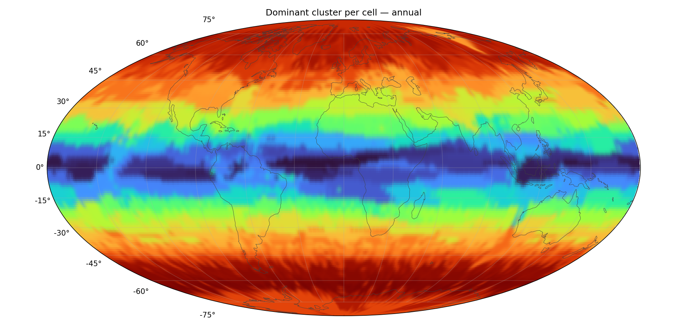
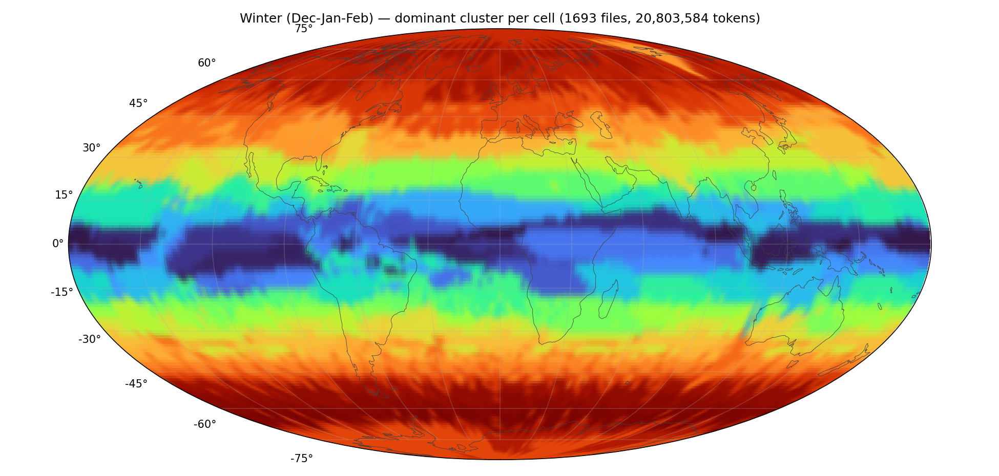
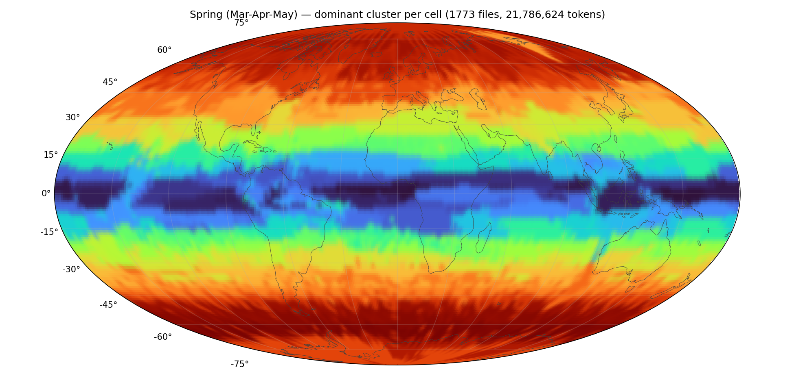
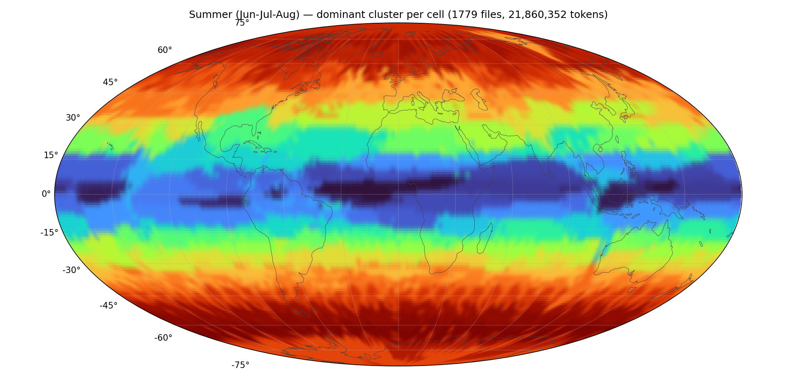
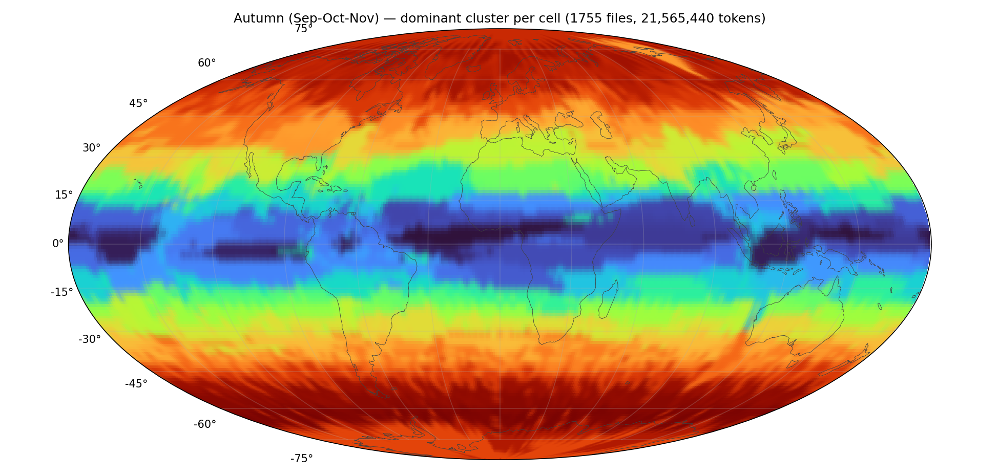
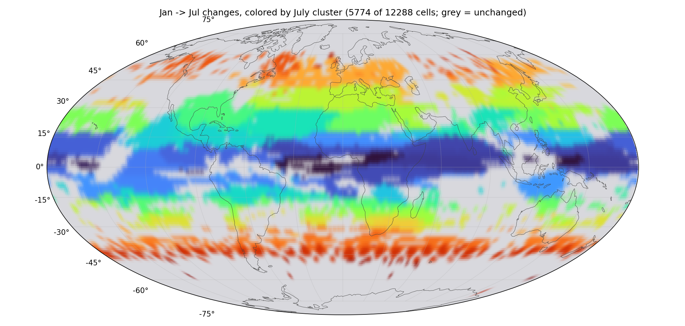
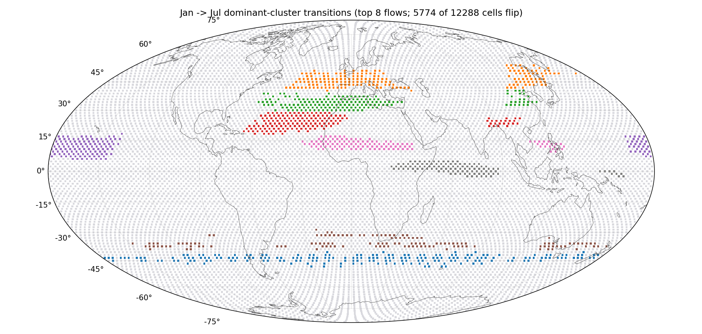

# Temporal & spatial report — `subspace_kmeans_runs/v8_seed2_d64/`

*Generated 2026-06-29 12:51 by `temporal_spatial.py`. K=128 affine subspaces (d=64), 86,016,000 tokens from 7000 files. Maps reuse this run's existing assignments (no recomputation).*

## Time axis

The latents are ERA5 atmospheric states at **6-hourly cadence** (00/06/12/18 UTC — 4 per day). Each file stores only an integer sample index (`idx`), **not a timestamp**, so the calendar date is reconstructed positionally:

> `datetime = 2014-01-01 00:00 UTC + idx × 6 h`

The 13,021 files therefore span **file 0 = 2014-01-01 00:00** through **file 13020 = 2022-11-30 00:00**. (A complete 9-year 2014→2022 ERA5 record would run to 2022-12-31 18:00 — about 127 more steps — so the last ~month of 2022 is treated as not fully covered.) Monthly and seasonal grouping below uses this reconstructed date.

Sampled files per calendar month: Jan 623, Feb 542, Mar 594, Apr 590, May 589, Jun 568, Jul 621, Aug 590, Sep 595, Oct 584, Nov 576, Dec 528.

Sampled files per season: DJF 1693, MAM 1773, JJA 1779, SON 1755.

## Annual map

Dominant cluster per HEALPix cell across the full sample (NESTED ordering; grey = no data). Continent outlines are Natural Earth 110m; the field is the per-cell RGB (from spectral-ordered cluster colors) interpolated to a smooth heatmap. **Subspace-similar clusters share hues**, so coherent regions read as gradients.

## How the colors work

Cluster colors are **not random** — they are assigned so similar clusters get similar colors, which is what makes the maps readable (and the heatmap interpolation legitimate). The pipeline (`worldmap.py`):

1. **Affinity matrix (K×K)** — for each cluster pair, how similar they are. With subspaces (d>0) it is the mean squared cosine of the principal angles between the two bases, `‖UᵢᵀUⱼ‖²_F / d ∈ [0,1]` (1 = same subspace, 0 = orthogonal); for point clusters (d=0) the cosine of the two centroids. High affinity ⇒ nearby / overlapping structure.
2. **Spectral seriation** — take the *Fiedler vector* (the 2nd-smallest eigenvector of the normalized graph Laplacian of that affinity matrix): the classic 1-D embedding that places similar items next to each other. Ranking clusters by their Fiedler coordinate gives a single similarity-ordered sequence.
3. **Colormap** — that rank (0…K−1) is mapped through the smooth perceptual `turbo` colormap, so the order of colors along the rainbow exactly follows the similarity order: neighboring hues = affinity-similar clusters.
4. **Heatmap** — each cell takes its dominant cluster's RGB, and it is the **RGB** (not the integer cluster id) that is interpolated across the map. Interpolating a categorical id would be meaningless, but because step 3 already gave similar clusters similar RGB, blending two neighbors yields a sensible in-between color.

Reading the maps:
- Genuine structure shows up as **smooth gradients** (a region slowly shading into a neighboring hue); only true salt-and-pepper noise stays speckled. A *random* hue assignment would put a sharp color jump at every boundary and alias fine sub-regions as spurious "scatter," especially at large K.
- The **absolute hue is arbitrary** — blue vs red just reflects a cluster's position in the Fiedler order, which has no physical meaning; only the *transitions* and *groupings* carry information. So two months can look similarly hued where the same cluster family dominates, even if the exact dominant cluster differs.

## Monthly maps

One dominant-cluster map per calendar month (same color scale as the annual map), revealing the seasonal cycle. Each cell is colored by its most frequent cluster among that month's tokens. Image files are in `subspace_kmeans_runs/v8_seed2_d64/maps/`

## Seasonal maps

The same dominant-cluster field aggregated into the four meteorological seasons (Northern Hemisphere convention; DJF groups December with the following January and February). Averaging three months each smooths the month-to-month noise and makes the broad seasonal regimes easier to read than the individual monthly maps. Same color scale throughout.

**Winter (Dec-Jan-Feb)** (1693 files, 20,803,584 tokens)

**Spring (Mar-Apr-May)** (1773 files, 21,786,624 tokens)

**Summer (Jun-Jul-Aug)** (1779 files, 21,860,352 tokens)

**Autumn (Sep-Oct-Nov)** (1755 files, 21,565,440 tokens)

### Season-to-season stability

Share of cells whose **dominant cluster changes** between consecutive seasons (cyclic, so the final row closes the loop SON→DJF). Lower than the monthly flip rate because three-month averaging absorbs short transient regimes.

| transition | cells changing dominant cluster |
|---|---|
| DJF→MAM | 16.5% |
| MAM→JJA | 34.9% |
| JJA→SON | 17.4% |
| SON→DJF | 33.7% |

## Most seasonal clusters

This table identifies which clusters behave like **seasonal regimes** (monsoon, sea-ice, snow cover) versus **year-round geographic regimes**.

**Enrichment** of each cluster per month = `(cluster share in month) / (its average share)`. Read it as a multiplier on the cluster's baseline presence: **1.0 = present at its normal level** that month, **2.0 = twice as concentrated** as usual, **0.5 = half**. A cluster that is genuinely year-round sits near 1.0 across every column; a cluster that erupts in summer and vanishes in winter swings far above and below 1.0. Because the metric is normalized by each cluster's own average, a small cluster and a large cluster are directly comparable: the number is about *timing*, not *size*.

**Seasonality** = `std / mean` of those 12 monthly enrichments (the coefficient of variation). It collapses the whole year into one score for *how peaked* a cluster is: **~0 = flat / aseasonal** (the same every month), **higher = more concentrated** into particular months. Rows are sorted by this score, so the clusters at the top are the most strongly seasonal ones in the run, and scanning their monthly columns tells you *when* each one peaks. An en-dash marks a month with no sampled data, which is excluded from the score rather than counted as zero.

The four right-hand columns repeat the same enrichment aggregated into seasons (DJF/MAM/JJA/SON) for a coarser, lower-noise read of the same signal: a cluster peaking in a single season shows one column well above 1.0 and the rest below.

| cluster | seasonality | Jan | Feb | Mar | Apr | May | Jun | Jul | Aug | Sep | Oct | Nov | Dec | DJF | MAM | JJA | SON |
|---|---|---|---|---|---|---|---|---|---|---|---|---|---|---|---|---|---|
| 55 | 1.13 | 0.00 | 0.00 | 0.02 | 0.10 | 1.18 | 2.39 | 2.57 | 2.64 | 2.30 | 0.59 | 0.01 | 0.00 | 0.00 | 0.43 | 2.54 | 0.98 |
| 28 | 1.11 | 0.03 | 0.03 | 0.05 | 0.13 | 0.77 | 2.09 | 2.81 | 2.82 | 2.11 | 0.80 | 0.12 | 0.04 | 0.03 | 0.31 | 2.58 | 1.02 |
| 15 | 1.10 | 0.01 | 0.00 | 0.01 | 0.05 | 0.54 | 1.78 | 2.54 | 2.70 | 2.58 | 1.30 | 0.23 | 0.05 | 0.02 | 0.20 | 2.35 | 1.39 |
| 12 | 1.07 | 0.01 | 0.01 | 0.03 | 0.11 | 0.69 | 1.80 | 2.62 | 2.73 | 2.31 | 1.17 | 0.24 | 0.07 | 0.03 | 0.28 | 2.39 | 1.25 |
| 108 | 1.04 | 0.01 | 0.00 | 0.02 | 0.10 | 0.86 | 2.11 | 2.47 | 2.63 | 2.18 | 1.16 | 0.23 | 0.05 | 0.02 | 0.33 | 2.40 | 1.20 |
| 102 | 0.99 | 0.03 | 0.02 | 0.04 | 0.24 | 1.08 | 1.98 | 2.49 | 2.57 | 2.03 | 1.02 | 0.26 | 0.07 | 0.04 | 0.45 | 2.35 | 1.11 |
| 126 | 0.93 | 2.52 | 2.43 | 1.90 | 1.15 | 0.27 | 0.02 | 0.00 | 0.00 | 0.07 | 0.59 | 1.31 | 1.89 | 2.29 | 1.11 | 0.01 | 0.65 |
| 118 | 0.92 | 2.59 | 2.68 | 1.97 | 1.14 | 0.46 | 0.22 | 0.14 | 0.11 | 0.16 | 0.33 | 0.71 | 1.58 | 2.31 | 1.19 | 0.16 | 0.40 |

## Month-to-month stability

Share of cells whose **dominant cluster changes** between consecutive months (low = stable geography; peaks mark the seasonal transitions). Over the 12 comparable month-pair(s): min **5.5%**, mean **12.6%**, max **22.2%**.

| transition | cells changing dominant cluster |
|---|---|
| Jan→Feb | 7.2% |
| Feb→Mar | 9.1% |
| Mar→Apr | 12.4% |
| Apr→May | 22.2% |
| May→Jun | 16.3% |
| Jun→Jul | 10.3% |
| Jul→Aug | 5.5% |
| Aug→Sep | 8.0% |
| Sep→Oct | 15.9% |
| Oct→Nov | 18.9% |
| Nov→Dec | 14.4% |
| Dec→Jan | 11.0% |

**Jan ↔ Jul** (winter vs summer hemisphere): **47.0%** of cells change dominant cluster. Largest cluster shifts (owned-cell count, Jul − Jan): 102: +356, 15: +289, 46: +286, 50: +231, 73: +208 ….

## Jan → Jul change maps

**By July destination.** The same flipped cells, now colored by each cell's **July** cluster (grey = held its cluster). Colors match the monthly and seasonal maps, so a changed region's hue tells you which July regime it joined; where a coherent area shares one color, a whole region migrated into the same summer cluster together.

**By transition.** The 8 most common dominant-cluster flows between January and July. Each color is one **A -> B flow** (cluster A in Jan becomes cluster B in Jul); grey cells either held their cluster or flipped via a rarer transition outside the top 8. Cells sharing a color all made the *same* move, so a coherent colored region is a single seasonal regime shift acting on a whole area. Note these rows are single A -> B flows, so they will not line up with the net per-cluster deltas above (which pool every source cluster).

| color | Jan cluster -> Jul cluster | cells |
|---|---|---|
| 0 | 52 -> 50 | 203 |
| 1 | 98 -> 46 | 189 |
| 2 | 71 -> 102 | 171 |
| 3 | 126 -> 15 | 167 |
| 4 | 10 -> 21 | 158 |
| 5 | 116 -> 109 | 133 |
| 6 | 113 -> 80 | 120 |
| 7 | 60 -> 67 | 113 |

## Interpretation notes

- **Stable geography + month-to-month flips near the minimum** ⇒ clusters are **geographic regimes** (region/surface type) that hold their territory year-round.
- **Clusters with high seasonality and a single summer/winter peak** ⇒ **seasonal regimes** (e.g. monsoon, sea-ice, snow cover); find them in the table above.
- **Jan↔Jul changes concentrate in one hemisphere** ⇒ a hemispheric seasonal cycle (opposite phases north/south).
- Monthly maps share one color scale, so a hue *appearing* in a region month-to-month is a real shift, not a recoloring.

*See the main clustering report (`subspace_kmeans_runs/v8_seed2_d64/report.md`) for convergence, variance decomposition, per-cluster spatial/temporal columns, and subspace affinity.*